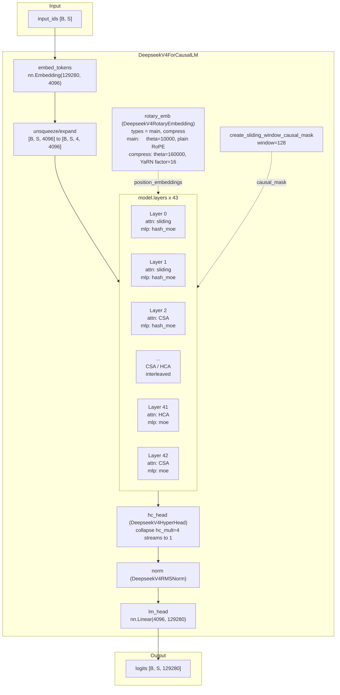
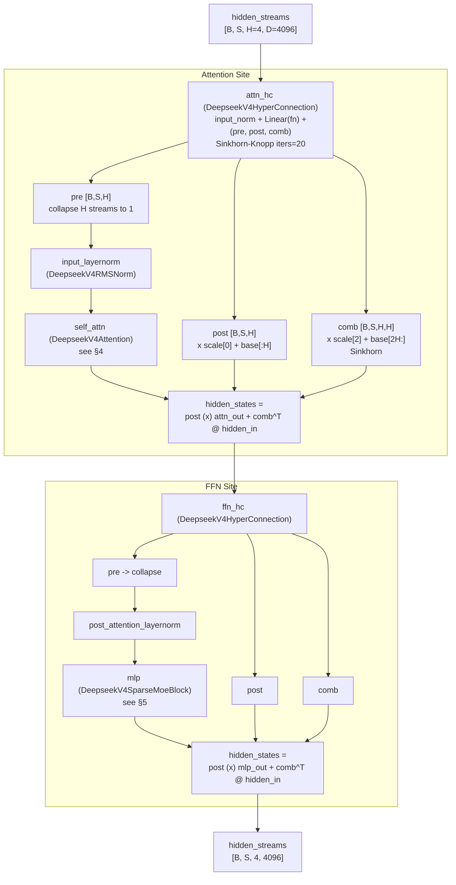
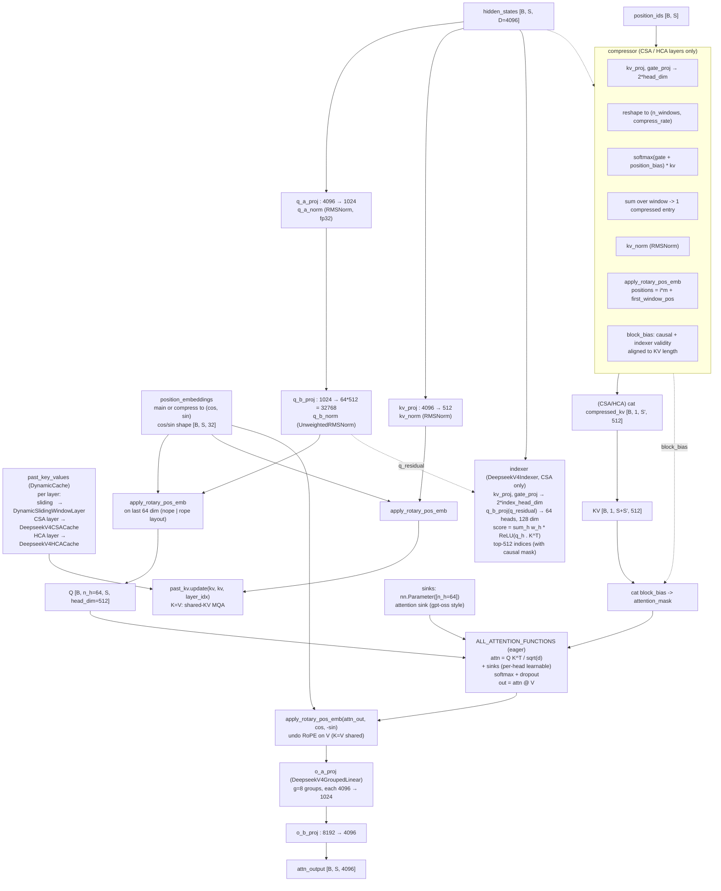
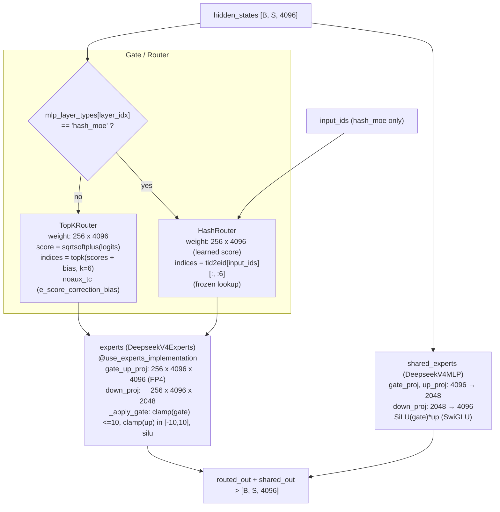
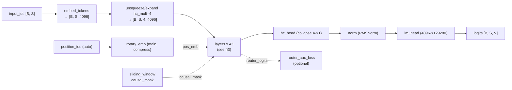
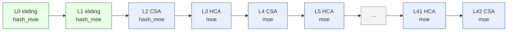

# DeepSeek-V4-Flash 架构结构图（ASC）

> 基于 [`DeepSeek-V4-Flash-config.json`](./config/DeepSeek-V4-Flash-config.json) 配置 + 本地 `transformers==5.9.0` 中 `transformers/models/deepseek_v4/` 源码核对。
> 注意：checkpoint 配置文件里记录的 `transformers_version` 是 `4.57.1`，但本地实际核对的推理实现版本是 `5.9.0`；下文会区分“配置中携带的旧字段”和“`__post_init__` 折叠后的运行时字段”。
> 源码路径：`transformers/models/deepseek_v4/{configuration_deepseek_v4.py, modeling_deepseek_v4.py, modular_deepseek_v4.py}`

---

## 1. 顶层结构（Top-level）

`DeepseekV4ForCausalLM` 继承 `DeepseekV4PreTrainedModel + GenerationMixin`，由 6 个核心部件组成：

| 组件                   | 类型                                      | 说明                                                                 |
| ---------------------- | ----------------------------------------- | -------------------------------------------------------------------- |
| `model.embed_tokens` | `nn.Embedding`                          | vocab=129280 → hidden=4096                                          |
| `model.layers`       | `nn.ModuleList[DeepseekV4DecoderLayer]` | 共**43** 层                                                    |
| `model.norm`         | `DeepseekV4RMSNorm`                     | 最终 RMSNorm                                                         |
| `model.rotary_emb`   | `DeepseekV4RotaryEmbedding`             | 复用给所有层                                                         |
| `model.hc_head`      | `DeepseekV4HyperHead`                   | 把 `hc_mult=4` 条流折叠回 1 条                                     |
| `lm_head`            | `nn.Linear`                             | hidden=4096 → vocab=129280（`tie_word_embeddings=false`，不共享） |

输入 `input_ids[B, S]`（V4 内部将 hidden_states 显式扩展为 `[B, S, hc_mult, D]`）→ 经 43 个 decoder 层 → `hc_head` + `norm` → `lm_head` → `logits[B, S, V]`。

### 1.1 关键超参（取自 config）

| 字段                         | 值                                       | 含义                                                    |
| ---------------------------- | ---------------------------------------- | ------------------------------------------------------- |
| `hidden_size`              | 4096                                     | 单条流的隐层维度 D                                      |
| `num_hidden_layers`        | 43                                       | 解码层数 L                                              |
| `num_attention_heads`      | 64                                       | 注意头数 n_h                                            |
| `head_dim`                 | 512                                      | 单头维度 c（**远超常规 64–128**）                |
| `num_key_value_heads`      | 1                                        | **Shared-KV MQA**，全注意力头共享 1 个 KV 头      |
| `q_lora_rank`              | 1024                                     | Q 的低秩瓶颈秩 r_q                                      |
| `o_lora_rank`              | 1024                                     | 分组输出投影中间维度 d_g                                |
| `o_groups`                 | 8                                        | 分组输出投影的组数 g                                    |
| `qk_rope_head_dim`         | 64                                       | 配置文件中的旧字段；运行时换算为 `partial_rotary_factor = 64/512 = 0.125` |
| `n_routed_experts`         | 256                                      | 路由专家数                                              |
| `n_shared_experts`         | 1                                        | 共享专家数                                              |
| `num_experts_per_tok`      | 6                                        | top-k 路由数                                            |
| `moe_intermediate_size`    | 2048                                     | 单个专家 FFN 中间维度                                   |
| `expert_dtype`             | `"fp4"`                                | 专家权重量化精度                                        |
| `scoring_func`             | `"sqrtsoftplus"`                       | 路由打分函数                                            |
| `topk_method`              | `"noaux_tc"`                           | 路由方法                                                |
| `routed_scaling_factor`    | 1.5                                      | 路由权重放大系数                                        |
| `norm_topk_prob`           | true                                     | 路由概率归一化                                          |
| `hc_mult`                  | 4                                        | mHC 残差流数 H                                          |
| `hc_sinkhorn_iters`        | 20                                       | Sinkhorn-Knopp 迭代次数                                 |
| `hc_eps`                   | 1e-6                                     | Sinkhorn 数值稳定项                                     |
| `index_n_heads`            | 64                                       | Lightning Indexer 头数                                  |
| `index_head_dim`           | 128                                      | Indexer 单头维度                                        |
| `index_topk`               | 512                                      | Indexer 保留 top-k 压缩条目数                           |
| `sliding_window`           | 128                                      | 滑动窗口大小 n_win                                      |
| `swiglu_limit`             | 10.0                                     | 专家 gate/up 预激活截断                                 |
| `max_position_embeddings`  | 1,048,576                                | 最大序列长度（1M）                                      |
| `rope_scaling`             | yarn, factor=16, orig=65536              | 长上下文外推                                            |
| `compress_rope_theta`      | 160000                                   | 压缩分支 RoPE 基频                                      |
| `compress_rates`           | `{"compressed_sparse_attention": 4, "heavily_compressed_attention": 128}` | 运行时压缩率字典；由配置类标准化后得到 |
| `compress_ratios`          | 长度 44，前 43 项被采纳                  | 配置文件中的旧字段；`__post_init__` 将其映射到运行时 `layer_types` |
| `num_hash_layers`          | 3                                        | 配置文件中的旧字段；运行时折叠为 `mlp_layer_types`      |
| `mlp_layer_types`          | `["hash_moe"]*3 + ["moe"]*40`          | 运行时每层 MLP 类型                                     |
| `layer_types`              | `["sliding_attention"]*2 + ["compressed_sparse_attention","heavily_compressed_attention"]*...` | 运行时每层注意力类型，由 `compress_ratios` 折叠得到 |
| `num_nextn_predict_layers` | 1                                        | MTP 层（**不实例化**）                            |
| `quantization_config`      | FP8 e4m3, dynamic, weight_block_size=128 | 权重量化                                                |
| `torch_dtype`              | bfloat16                                 | 激活/权重主精度                                         |
| `tie_word_embeddings`      | false                                    | 输入/输出嵌入不共享                                     |

### 1.2 注意力层 schedule（`layer_types`）

这个 checkpoint 没有显式给 `layer_types`，而是通过旧字段 `compress_ratios` 在 `DeepseekV4Config.__post_init__` 中折叠得到 43 层的运行时 `layer_types`。其分布为：

| 类型                             | 压缩率 | 含义                    | 层数         | 层索引                  |
| -------------------------------- | ------ | ----------------------- | ------------ | ----------------------- |
| `sliding_attention`            | 0      | 纯滑动窗口，无压缩      | **2**  | 0, 1                    |
| `compressed_sparse_attention`  | 4      | CSA + Lightning Indexer | **21** | 2, 4, 6, …, 42（偶数） |
| `heavily_compressed_attention` | 128    | HCA 长程压缩            | **20** | 3, 5, 7, …, 41（奇数） |

即：这个 checkpoint 的实际 schedule 是“前两层纯滑动窗 + 之后 CSA / HCA 严格交错”。这和配置类在“未提供 `compress_ratios` / `layer_types` 时”的默认 schedule（前两层 HCA bootstrap）不是一回事。

### 1.3 MLP 层 schedule

同理，这个 checkpoint 通过旧字段 `num_hash_layers=3` 在 `__post_init__` 中折叠得到运行时 `mlp_layer_types`：

| 类型                  | 层数 | 层索引  |
| --------------------- | ---- | ------- |
| `hash_moe`          | 3    | 0, 1, 2 |
| `moe`（标准 top-k） | 40   | 3 … 42 |

---

## 2. 架构总览图

### 2.1 Mermaid 图



### 2.2 ASCII 字符图

```
                            DeepseekV4ForCausalLM
   ┌──────────────────────────────────────────────────────────────────────────┐
   │                                                                          │
input_ids           rotary_emb (main/compress)        sliding_window mask
[B, S]              cos/sin for {main,compress}       window = 128
   │                          │                              │                │
   ▼                          │                              │                │
embed_tokens                  │                              │                │
nn.Embedding                  │                              │                │
(129280 → 4096)               │                              │                │
   │                          │                              │                │
   ▼                          │                              │                │
unsqueeze/expand              │                              │                │
[B,S,4096]                    │                              │                │
   │                          │                              │                │
   ▼                          │                              │                │
[B,S,4,4096]                  │                              │                │
   │                          │                              │                │
   ├──────────────────────────┼──────────────────────────────┘                │
   │                          │                                               │
   ▼                          ▼                                               │
┌──────────────────────────────────────────────────────┐                      │
│  model.layers  ×  43  (see §3)                       │                      │
│                                                      │                      │
│  L0  sliding + hash_moe   ─┐                         │                      │
│  L1  sliding + hash_moe    │  2 sliding / 21 CSA     │                      │
│  L2  CSA     + hash_moe    │  / 20 HCA, 3 hash_moe / │                      │
│  L3  HCA     + moe         │  40 moe                 │                      │
│  L4  CSA     + moe         │  (CSA/HCA strict        │                      │
│  ...                       │   interleaved)          │                      │
│  L41 HCA     + moe         │                         │                      │
│  L42 CSA     + moe        ─┘                         │                      │
│                                                      │                      │
└──────────────────────────┬───────────────────────────┘                      │
                           │                                                  │
                           ▼                                                  │
                  ┌────────────────┐                                          │
                  │   hc_head      │  DeepseekV4HyperHead                      │
                  │   4 streams    │  collapse hc_mult=4 → 1                    │
                  │   → 1 stream   │                                          │
                  └───────┬────────┘                                          │
                          ▼                                                   │
                  ┌────────────────┐                                          │
                  │   RMSNorm      │  DeepseekV4RMSNorm                       │
                  └───────┬────────┘                                          │
                          ▼                                                   │
                  ┌────────────────┐                                          │
                  │   lm_head      │  nn.Linear(4096, 129280)                 │
                  │   4096 → V     │  (tie_word_embeddings = false)           │
                  └───────┬────────┘                                          │
                          ▼                                                   │
                  logits [B, S, 129280]                                       │
                                                                              │
   └──────────────────────────────────────────────────────────────────────────┘
```

---

---

## 3. 单个 `DeepseekV4DecoderLayer` 内部残差

`DecoderLayer` 与传统 Pre-Norm 残差块**有两点根本差异**：

- 残差不是单条流 `[B, S, D]`，而是 `hc_mult=4` 条并行流 `[B, S, H, D]`，全程贯穿。
- 每个子层（attn / ffn）前后各嵌一个 `DeepseekV4HyperConnection`（mHC），用 Sinkhorn-Knopp 把 `comb` 投影到**双随机矩阵流形**上。

### 3.0 Mermaid 图



### 3.0.1 ASCII 字符图

```
hidden_streams [B, S, H=4, D=4096]                                    (4 streams)
       │
       ▼
   ┌───────────────────────────────────────────────────────────────┐
   │  attn_hc  (DeepseekV4HyperConnection, see §3.1)               │
   │                                                               │
   │   input_norm (UnweightedRMSNorm, fp32)                        │
   │     → Linear(flat, fn)        fn: (2+H)*H × H*D = 24 × 16384 │
   │     → split → pre_w, post_w, comb_w                           │
   │     → pre   = σ(pre_w · scale[0]  + base[:H])  + ε            │
   │     → post  = 2·σ(post_w · scale[1] + base[H:2H])             │
   │     → comb  = softmax(comb_w · scale[2] + base[2H:]) + ε      │
   │     → Sinkhorn-Knopp × hc_sinkhorn_iters=20                   │
   │                                                               │
   │   collapsed = Σ_h  pre[h] · hidden_streams[..., h, :]         │
   └─────────────────┬─────────────────────────────────────────────┘
                     │ collapsed [B, S, D=4096]                    (1 stream)
                     ▼
              input_layernorm (RMSNorm)
                     │
                     ▼
              self_attn (DeepseekV4Attention, §4)
              out: attn_output [B, S, 4096]
                     │
                     ▼
   ┌───────────────────────────────────────────────────────────────┐
   │  hidden_states ← post ⊗ attn_output + comb^T @ hidden_in     │
   │  shape: [B, S, H=4, D=4096]                                  │
   └─────────────────┬─────────────────────────────────────────────┘
                     │                                              (4 streams)
                     ▼
   ┌───────────────────────────────────────────────────────────────┐
   │  ffn_hc  (DeepseekV4HyperConnection, 同上)                     │
   └─────────────────┬─────────────────────────────────────────────┘
                     │ collapsed
                     ▼
              post_attention_layernorm
                     │
                     ▼
              mlp (DeepseekV4SparseMoeBlock, §5)
              out: mlp_output [B, S, 4096]
                     │
                     ▼
   ┌───────────────────────────────────────────────────────────────┐
   │  hidden_states ← post ⊗ mlp_output + comb^T @ hidden_in      │
   │  shape: [B, S, H=4, D=4096]                                  │
   └─────────────────┬─────────────────────────────────────────────┘
                     │
                     ▼
       hidden_streams [B, S, H=4, D=4096]                          (4 streams)
```

### 3.1 `DeepseekV4HyperConnection`（mHC，论文 §2.2）

输入 `hidden_streams [B, S, H, D]`，输出 `(post, comb, collapsed)`：

```
flat       = RMSNorm( hidden_streams.flatten(2) )                # [B, S, H*D]
pre_w, post_w, comb_w = split( Linear(flat, fn), [H, H, H*H] )   # fn: (2+H)*H × H*D
pre   = σ(pre_w*scale[0]  + base[:H])   + ε                       # [B,S,H]
post  = 2·σ(post_w*scale[1] + base[H:2H])                        # [B,S,H]
comb  = softmax(comb_w*scale[2] + base[2H:]) + ε                  # [B,S,H,H]
comb /= sum(comb, dim=-2) + ε                                     # 行归一化
for _ in range(hc_sinkhorn_iters - 1):
    comb /= sum(comb, dim=-1) + ε                                 # 列归一化
    comb /= sum(comb, dim=-2) + ε                                 # 行归一化
collapsed = (pre.unsqueeze(-1) * hidden_streams).sum(dim=2)       # [B,S,D]
return post, comb, collapsed
```

`post`、`comb` 在子层输出侧按下式注入（见 `forward`）：

```
hidden_states = post ⊗ sublayer_out + combᵀ @ hidden_in
```

所以整个 DecoderLayer 是：

```text
4条流
  → Attention前mHC：合成1条
  → Attention
  → Attention后mHC：新结果分发 + 旧流混合
  → FFN前mHC：合成1条
  → FFN/MoE
  → FFN后mHC：新结果分发 + 旧流混合
  → 还是4条流

```

---

## 4. `DeepseekV4Attention` 内部

共享-KV MQA + LoRA-Q + 分组输出投影 +（CSA / HCA 时）压缩器 + 部分 RoPE + 可学习 attention sink。

### 4.0 Mermaid 图



### 4.0.1 ASCII 字符图

```
                    hidden_states [B, S, 4096]                       position_embeddings
                            │                                       {main | compress} → (cos, sin)
                            │                                       cos/sin shape: [B, S, qk_rope_head_dim/2 = 32]
                            │
        ┌───────────────────┴─────────────────────┐                  position_ids [B, S]
        │                                         │                  past_key_values (DynamicCache)
        │ Q path (LoRA-Q)                         │ KV path          sliding:   DynamicSlidingWindowLayer
        │                                         │                  CSA layer: DeepseekV4CSACache
   ┌────▼────────────────┐                ┌───────▼─────────┐        HCA layer: DeepseekV4HCACache
   │ q_a_proj  4096→1024  │                │ kv_proj  4096→512│
   │ q_a_norm (fp32)     │                │ kv_norm (RMSNorm)│
   └────────┬─────────────┘                └────────┬─────────┘
            ▼                                       │
   ┌────────────────────┐                           │
   │ q_b_proj 1024→32768│                           │
   │ q_b_norm           │                           │
   └────────┬───────────┘                           │
            ▼                                       ▼
   ┌─────────────────────────────────────┐  apply_rotary_pos_emb
   │ apply_rotary_pos_emb (last 64 dim)  │  on rope slice
   │ Q [B, 64, S, 512]                   │─────────┐
   └─────────────────────────────────────┘         │
                                                   │
                                          ┌────────▼────────┐
                                          │ past_kv.update  │◄─────── cache (sliding window=128, K=V)
                                          │ (K=V shared)    │
                                          └────────┬────────┘
                                                   │
                                       ┌───────────┴────────────┐
                                       │ CSA / HCA layer only?  │
                                       └─────┬────────────┬─────┘
                                            no           yes
                                             │            │
                                             │            ▼
                                             │   ┌─────────────────────────────────────┐
                                             │   │ Compressor (DeepseekV4CSA/HCACompressor)
                                             │   │                                     │
                                             │   │ kv_proj / gate_proj → 2·head_dim     │
                                             │   │ reshape → (n_windows, compress_rate) │
                                             │   │ softmax(gate + position_bias) ⊙ kv  │
                                             │   │ sum over window → 1 压缩条目          │
                                             │   │ kv_norm (RMSNorm)                    │
                                             │   │ RoPE @ positions = i·m + first_pos   │
                                             │   └─────────────┬───────────────────────┘
                                             │                 │ compressed_kv [B, 1, n_ent, 512]
                                             │                 │ block_bias (causal + indexer valid)
                                             │                 ▼
                                             │   ┌────────────────────────────┐
                                             │   │ cat(KV, compressed_kv)     │    ─── only for CSA: also
                                             │   │ cat(attention_mask,        │    ─── run DeepseekV4Indexer
                                             │   │     block_bias)            │    ─── to get top-512 indices
                                             │   └─────────────┬──────────────┘    ─── block_bias = top-k + causal
                                             │                 │
                                             ▼                 ▼
                                          ┌──────────────────────────┐
                                          │  ALL_ATTENTION_FUNCTIONS │
                                          │                          │
                                          │  attn = Q Kᵀ / √d        │   sinks: nn.Parameter([64])
                                          │  + sinks (per-head)      │   gpt-oss style
                                          │  softmax  →  attn @ V    │
                                          └──────────────┬───────────┘
                                                         │ attn_output [B, 64, S, 512]
                                                         ▼
                                          ┌──────────────────────────┐
                                          │ apply_rotary_pos_emb(    │
                                          │   attn_out, cos, -sin)   │  ── 抵消 V 上的 RoPE
                                          │ (K=V 时)                  │
                                          └──────────────┬───────────┘
                                                         │ [B, S, 32768]
                                                         ▼
                                          ┌──────────────────────────┐
                                          │ reshape (g=8)            │
                                          │ → o_a_proj (Grouped)     │  g=8 groups × 4096 → 1024
                                          │   DeepseekV4GroupedLinear│  output: [B, S, 8, 1024]
                                          └──────────────┬───────────┘
                                                         ▼
                                          ┌──────────────────────────┐
                                          │ flatten 8192             │
                                          │ → o_b_proj 8192 → 4096   │
                                          └──────────────┬───────────┘
                                                         ▼
                                              attn_output [B, S, 4096]
```

简单说：

```text
hidden_states
   ├─ 生成 Q
   ├─ 生成共享 KV
   ├─ 更新 cache，保留最近滑动窗口
   ├─ 某些层额外生成压缩 KV
   ├─ Q 查 KV，得到 attention 输出
   └─ 分组输出投影，变回 [B, S, 4096]

```

### 4.1 关键公式与维度

- **Q**：`q_a_proj(4096→1024) → q_a_norm(fp32) → q_b_proj(1024→32768) → q_b_norm → rope` → `[B, 64, S, 512]`
- **KV**（Shared-KV MQA）：`kv_proj(4096→512) → kv_norm → rope`，`keys=values`，broadcast 到 64 头：`repeat_kv`
- **滑动窗口**：每次 update 保留最新 `sliding_window=128` 个 token；CSA/HCA 层会把该 `cache.update(kv, kv, …)` 拼到 KV 序列后
- **压缩器输出**：`compressed_kv [B, 1, n_entries, 512]`，与滑动窗 KV 在 seq 维 cat
- **`block_bias`**：CSA 用 indexer 的 top-k + 因果；HCA 用每查询 `(t+1)//m'` 的窗口阈值
- **输出**：`attn_out [B, S, 32768] → reshape (g=8) → o_a_proj 每组 4096→1024 → flatten 8192 → o_b_proj 4096`
- **sinks**：每个 head 一个标量，cat 到 attention logits 末尾作为"虚拟 token"（gpt-oss 风格）

### 4.2 压缩器类型对照

| `layer_type`                   | 压缩器类                    | 压缩率 m | Compressor 形态                                                                                                                                    |
| -------------------------------- | --------------------------- | -------- | -------------------------------------------------------------------------------------------------------------------------------------------------- |
| `sliding_attention`            | `None`                    | 0        | 无压缩，纯滑动窗 + K=V                                                                                                                             |
| `compressed_sparse_attention`  | `DeepseekV4CSACompressor` | 4        | `kv_proj → 2·head_dim`、两系列 Ca/Cb overlap、每 m=4 出一个压缩条目；外加 `DeepseekV4Indexer`（独立 q_b_proj / weights_proj）做 top-512 选块 |
| `heavily_compressed_attention` | `DeepseekV4HCACompressor` | 128      | `kv_proj → head_dim`、单系列、每 m'=128 出 1 个压缩条目；**无 indexer**                                                                   |

---

## 5. `DeepseekV4SparseMoeBlock` 内部

### 5.0 Mermaid 图



### 5.0.1 ASCII 字符图

```
                  hidden_states [B, S, 4096]                input_ids
                          │                                   │
                          ▼                                   │ (used only for hash_moe)
                  ┌───────────────────┐                       │
                  │ is this layer a   │                       │
                  │ 'hash_moe' layer? │                       │
                  └──────┬──────┬─────┘                       │
                       yes     no                             │
                        │       │                             │
                        ▼       ▼                             │
              ┌─────────────┐  ┌──────────────────────────┐   │
              │ HashRouter  │  │ TopKRouter               │   │
              │             │  │                          │   │
              │ weight:     │  │ weight: 256 × 4096       │   │
              │   256×4096  │  │ logits = xW              │   │
              │   (learned) │  │ scores = sqrtsoftplus    │   │
              │             │  │   (logits)               │   │
              │ indices:    │  │ indices = topk(          │   │
              │   frozen    │  │   scores + bias, k=6)    │   │
              │   tid2eid   │  │   noaux_tc               │   │
              │   [ids][:6] │◄─┤                          │   │
              │   (lookup)  │  │                          │   │
              └──────┬──────┘  └────────────┬─────────────┘   │
                     │                       │                 │
                     │ scores.gather(...)    │ scores.gather() │
                     │ weights /= sum ×1.5   │ weights /= sum ×1.5
                     │                       │                 │
                     └───────────┬───────────┘                 │
                                 │                             │
                                 ▼                             │
                  ┌────────────────────────────────────┐        │
                  │ experts (DeepseekV4Experts)        │        │
                  │   @use_experts_implementation      │        │
                  │   gate_up_proj: 256 × 4096 × 4096  │        │
                  │   down_proj:     256 × 4096 × 2048  │        │
                  │                                    │        │
                  │   per token t, top_k=6 experts:    │        │
                  │     gate_up = x @ gate_up_proj[e]  │        │
                  │     gate, up = chunk(2)            │        │
                  │     gate = clamp(gate, ≤10)        │        │
                  │     up   = clamp(up, [-10,10])      │        │
                  │     h = silu(gate) * up            │        │
                  │     y = h @ down_proj[e] * w_e      │        │
                  │   accumulate across active experts │        │
                  └─────────────────┬──────────────────┘        │
                                    │                           │
                                    │                           │
                  ┌─────────────────▼──────────────────┐        │
                  │ shared_experts (DeepseekV4MLP)     │        │
                  │                                    │        │
                  │   gate_proj: 4096 → 2048           │        │
                  │   up_proj:   4096 → 2048           │        │
                  │   down_proj: 2048 → 4096           │        │
                  │   y = down( silu(gate) * up )      │        │
                  │   (always run, no routing)         │        │
                  └─────────────────┬──────────────────┘        │
                                    │                           │
                                    ▼                           │
                       routed + shared → [B, S, 4096]            │
                                                                 │
                  hidden_states (residual) ─────────────────────┘
```

### 5.1 Router 选型（按 `mlp_layer_types[layer_idx]`）

| 层范围                     | Router 类                | 选专家方式                                 | 备注                                                                                            |
| -------------------------- | ------------------------ | ------------------------------------------ | ----------------------------------------------------------------------------------------------- |
| `layer_idx ∈ [0, 1, 2]` | `DeepseekV4HashRouter` | `tid2eid[input_ids]` frozen lookup       | 仍用学到的 `weight` 给所选专家打分，权重 = `routed_scaling_factor=1.5`                      |
| `layer_idx ∈ [3, 42]`   | `DeepseekV4TopKRouter` | `topk(sqrtsoftplus(logits) + bias, k=6)` | `noaux_tc` 用 `e_score_correction_bias` 偏置项；输出权重经 `norm_topk_prob` 归一并 × 1.5 |

### 5.2 专家计算

```
routed  = experts(hidden_states, top_k_index, top_k_weights)
shared  = shared_experts(hidden_states)        # 始终存在
return  = routed + shared
```

`@use_experts_implementation` 装饰允许将 `DeepseekV4Experts` 在 eager 实现 / grouped_mm / batched_mm 之间自动切换（取决于可用 kernel）。

---

## 6. 缓存 / KV Cache 设计

| 注意力层类型                     | Cache 类                          | 额外维护的 state                                                                                                                                |
| -------------------------------- | --------------------------------- | ----------------------------------------------------------------------------------------------------------------------------------------------- |
| `sliding_attention`            | `DynamicSlidingWindowLayer`     | 仅滑动窗 K=V                                                                                                                                    |
| `compressed_sparse_attention`  | `DeepseekV4CSACache` (继承 HCA) | `compressor` + `indexer` 两套 `(buffer_kv, buffer_gate, compressed_kv, entry_count)`；`overlap_kv/gate` 保存 Ca 切片用于跨 forward 拼接 |
| `heavily_compressed_attention` | `DeepseekV4HCACache`            | `compressor` 一套 `(buffer_kv, buffer_gate, compressed_kv, entry_count)`；非重叠窗口，无 overlap                                            |

Compressor 通过 `store_compression_weights` 把新 token 拼到 buffer，按 `compress_rate` 切窗；通过 `update_compressor_states` 追加已发射条目并维护 `entry_count`（用于绝对位置编码）。

`Decode` 阶段的内存公式单独放在后面的 **§13 Decode 阶段内存需求公式**，避免和这里的 cache 结构说明混在一起。

---

## 7. RoPE 与位置编码

`DeepseekV4RotaryEmbedding` 运行时按 `rope_type_labels = ("main", "compress")` 建两套 buffer。它们不是直接从 JSON 中的 `rope_parameters` 读出来的，而是 `DeepseekV4Config.__post_init__` 用 `rope_theta`、`compress_rope_theta`、`rope_scaling` 和 `partial_rotary_factor` 组装出来的：

- `main`：`rope_type=default`, `theta=10000`, 仅滑动层用
- `compress`：`rope_type=yarn`, `theta=compress_rope_theta=160000`, `factor=16`, `original_max_position_embeddings=65536`, `attention_factor=1.0`, CSA/HCA 与其内部 indexer 共用

`partial_rotary_factor = qk_rope_head_dim / head_dim = 64 / 512 = 0.125`，其中 `qk_rope_head_dim` 是配置类在运行时回填的属性，不是 dataclass 固定字段。每头 layout = `[nope(448) | rope(64)]`。`apply_rotary_pos_emb` 仅对最后 64 维做交错 RoPE：`rope_dim = cos.shape[-1] * 2` 配 `repeat_interleave(2)`，与 `rotate_half` 配对实现 "interleaved" 形式。

K=V 时还需在 `attn_output` 上施加一次 `apply_rotary_pos_emb(_, cos, -sin)`，抵消 V 上加的 RoPE。

---

## 8. `DeepseekV4ForCausalLM.forward` 数据流

### 8.0 Mermaid 图



### 8.0.1 ASCII 字符图

```
   input_ids [B, S]              position_ids (auto-arange)
       │                                │
       ▼                                │
   embed_tokens                         │
   nn.Embedding(129280, 4096)           │
       │                                │
       ▼                                │
   unsqueeze(2).expand(hc_mult=4)       │
   [B, S, 4, 4096]                      │
       │                                │
       │       ┌──► rotary_emb {main, compress} ──► pos_emb (cos, sin)
       │       │        ▲
       │       │        │ position_ids
       │       │
       ▼       │
   ┌──────────────────────────────────────────────────────────┐
   │  layers × 43                                            │
   │  for each layer: hidden_states = decoder_layer(         │
   │      hidden_states, position_embeddings=pos_emb,        │
   │      position_ids=..., attention_mask=mask,              │
   │      past_key_values=cache, input_ids=input_ids,         │
   │      ...                                                │
   │  )                                                      │
   │  → router_logits 通过 `capture_outputs` 从 router 侧录出 │
   └──────────────────────────┬───────────────────────────────┘
                              │   sliding_window causal_mask  (build once at top)
                              │                                │
                              ▼                                │
                         hc_head                              │
                         collapse 4 → 1                        │
                              │                                │
                              ▼                                │
                          RMSNorm                              │
                              │                                │
                              ▼                                │
                          lm_head                              │
                          4096 → 129280                        │
                              │                                │
                              ▼                                │
                         logits [B, S, V]                       │
                                                            
   aux_loss = load_balancing_loss(router_logits)
   total_loss += router_aux_loss_coef * aux_loss
               (仅当 `output_router_logits=True` 时计算 aux_loss；
                仅当同时给了 `labels` 时才加回主 loss)
```

---

## 9. 量化 / 部署相关

- `quantization_config.quant_method = "fp8"`, `fmt = "e4m3"`, `activation_scheme = "dynamic"`, `scale_fmt = "ue8m0"`, `weight_block_size = [128, 128]`
- 专家权重额外 `expert_dtype = "fp4"`（与 FP8 主权重不同精度）
- `base_model_ep_plan`（EP-only）:
  - `layers.*.mlp.gate` → `ep_router`
  - `layers.*.mlp.experts.gate_up_proj` / `down_proj` → `grouped_gemm`
  - `layers.*.mlp.experts` → `moe_tp_experts`
- **没有 `base_model_tp_plan`**：V4 不走纯 TP，因 shared-KV MQA + 压缩器分支广播单 KV 头到所有头，TP 切分 `q_b_proj` 会让 KV 仍为复制态而 `repeat_kv` 与 rank-local head 数对不上
- `_supports_flash_attn = _supports_sdpa = _supports_flex_attn = False`，`head_dim=512` 超过 FA 的 256 上限；SDPA 不支持 per-head sink；FlexAttention 不能在运行时扩展 BlockMask
- `_is_stateful = True`：`compressor` 滚动窗状态不可回滚，禁掉 assisted/prompt-lookup/contrastive search
- `_keys_to_ignore_on_load_unexpected = [r"(^|\.)mtp\..*"]`：MTP 层（`num_nextn_predict_layers=1`）随上游 checkpoint 加载但**不实例化**
- 训练保留 `_keep_in_fp32_modules_strict`：`attn_hc`, `ffn_hc`, `e_score_correction_bias`, `q_a_norm`, `kv_norm`, `input_layernorm`, `post_attention_layernorm`, `norm`

---

## 10. 总览：一图看懂 V4-Flash

### 10.0 Mermaid 图



### 10.0.1 ASCII 字符图

```
   ┌────────────────────────────────────────────────────────────────────────┐
   │                                                                        │
   │   L0   ┌──────────┐   sliding_attention  +  hash_moe      (bootstrap) │
   │   L1   ├──────────┤   sliding_attention  +  hash_moe                  │
   │   L2   ├──────────┤   CSA (m=4)          +  hash_moe                  │
   │   L3   ├──────────┤   HCA (m=128)        +  moe                       │
   │   L4   ├──────────┤   CSA                +  moe                       │
   │   L5   ├──────────┤   HCA                +  moe                       │
   │   L6   ├──────────┤   CSA                +  moe                       │
   │   L7   ├──────────┤   HCA                +  moe                       │
   │   ...  ├──────────┤   CSA / HCA 严格交错  +  moe                       │
   │   L40  ├──────────┤   CSA                +  moe                       │
   │   L41  ├──────────┤   HCA                +  moe                       │
   │   L42  └──────────┘   CSA                +  moe                       │
   │                                                                        │
   │       ┌── 2 sliding  (L0-L1)                                           │
   │       ├── 21 CSA     (L2, L4, L6, ..., L42)                             │
   │       ├── 20 HCA     (L3, L5, L7, ..., L41)                             │
   │       │                                                                  │
   │       ├── 3 hash_moe (L0-L2)                                            │
   │       └── 40 moe     (L3-L42)                                           │
   │                                                                        │
   │       total: 43 layers, 4D-parallel hidden_streams throughout          │
   │                                                                        │
   └────────────────────────────────────────────────────────────────────────┘
```

- **左半（0–1）**：纯滑动窗 + Hash-MoE bootstrap
- **中段（2–42）**：CSA / HCA 严格交错 + 标准 top-k MoE
- **总参数概览（粗算，未含 mHC 额外参数）**：
  - Attention 路径：43 ×（q_a_proj 4096→1024 + q_b_proj 1024→32768 + kv_proj 4096→512 + o_a_proj(8·4096→8·1024) + o_b_proj 8192→4096 + sinks_64）
  - CSA 层额外：1 个 `CSACompressor`（kv_proj 4096→1024, gate_proj 4096→1024, position_bias 4×1024, kv_norm）+ 1 个 `Indexer`（kv_proj 4096→256, gate_proj 4096→256, position_bias 4×256, kv_norm, q_b_proj 1024→8192, weights_proj 4096→64）
  - HCA 层额外：1 个 `HCACompressor`（kv_proj 4096→512, gate_proj 4096→512, position_bias 128×512, kv_norm）
  - MoE：3 × hash_moe（与标准 moe 共享 `experts` + `shared_experts`，仅 router 不同）+ 40 × 标准 moe
  - mHC：每层 2 × `HyperConnection`（每条流 fn `(2+4)·4=24` × `4·4096=16384`，base 24，scale 3）
  - Embed / LM：129280 × 4096 + 4096 × 129280（不共享）

---

## 11. 关键超参速查表

| 维度                            | 值                                                                                 |
| ------------------------------- | ---------------------------------------------------------------------------------- |
| 架构类型                        | `DeepseekV4ForCausalLM`（decoder-only）                                          |
| 层数 L                          | 43                                                                                 |
| 隐藏维度 D                      | 4096                                                                               |
| 注意力头 n_h                    | 64                                                                                 |
| 单头维度 c                      | 512                                                                                |
| KV 头 n_kv                      | 1（Shared-KV MQA）                                                                 |
| Q LoRA 秩                       | 1024                                                                               |
| O 分组数 / 组秩                 | 8 / 1024                                                                           |
| 滑动窗口 n_win                  | 128                                                                                |
| 压缩率（CSA / HCA）             | 4 / 128                                                                            |
| Indexer 头数 / 单头维度 / top-k | 64 / 128 / 512                                                                     |
| mHC 流数 / Sinkhorn 迭代        | 4 / 20                                                                             |
| 路由专家 / 共享专家 / top-k     | 256 / 1 / 6                                                                        |
| Hash-MoE 层数                   | 3（layers 0–2）                                                                   |
| 专家中间维度                    | 2048                                                                               |
| 路由打分                        | `sqrtsoftplus` + `noaux_tc` bias                                               |
| 词表 V                          | 129280                                                                             |
| 最大上下文                      | 1,048,576（YaRN factor=16, orig=65536）                                            |
| 主精度                          | bfloat16                                                                           |
| 权重量化                        | FP8 e4m3（128×128 block，ue8m0 scale）                                            |
| 专家量化                        | FP4                                                                                |
| 激活函数                        | SiLU（SwiGLU 路由，limit=10）                                                      |
| MTP                             | 1 层（不实例化）                                                                   |
| 不支持后端                      | FlashAttention 2/3/4（head_dim>256）、SDPA（无 sink）、FlexAttention（动态 KV 长） |

---

## 12. Prefill 阶段算力估算（以 128K token 输入为例）

> 取 `S = 128 × 1024 = 131072`（128K）作为示例。
> 全部公式中的变量名 **与 config.json 字段名一一对应**（`hidden_size`、`num_attention_heads`、`head_dim`…）。
> FLOPs 计数约定：1 次 multiply-add = 2 FLOPs；norm / RoPE / embedding / 路由打分 / `topk` / `Sinkhorn-Knopp` 等小项忽略。

### 12.1 单层 FLOPs 模板

把每层拆成 6 个算力块：**Attn-Q 路径**、**Attn-KV 投影**、**Attn-核心**、**Compressor**（CSA/HCA）、**Indexer**（CSA）、**Attn-Output 路径**、**MoE**。

#### (1) Attn-Q 路径（每层都跑）

```
q_a_proj : hidden_size → q_lora_rank
q_b_proj : q_lora_rank → num_attention_heads · head_dim

FLOPs_Q = 2 · S · [ hidden_size · q_lora_rank
                    + q_lora_rank · num_attention_heads · head_dim ]
        = 2 · S · [ D · r_q + r_q · n_h · c ]
```

#### (2) Attn-KV 投影（每层都跑）

```
kv_proj : hidden_size → head_dim
FLOPs_KV_proj = 2 · S · D · c
```

#### (3) 核心注意力（依赖 layer_type）

核心注意力的 `KV` 长度 `L_kv(layer_type)`：

| layer_type | `L_kv` |
|---|---|
| `sliding_attention` | `sliding_window`（=128） |
| `compressed_sparse_attention` | `sliding_window + index_topk`（= 128 + 512 = 640） |
| `heavily_compressed_attention` | `sliding_window + ⌈S / (2·compress_rate_hca)⌉`（≈ 128 + 512 = 640，因果掩码下平均可见压缩条目数） |

```
FLOPs_core = 4 · S · L_kv · num_attention_heads · head_dim
           = 4 · S · L_kv · n_h · c
```

#### (4) Compressor（仅 CSA / HCA 层）

`DeepseekV4{CSA,HCA}Compressor.__init__` 里有 `kv_proj` + `gate_proj`：

| layer_type | 投影输出维度（per `kv`/`gate`） | 单 token 合计 FLOPs |
|---|---|---|
| `sliding_attention` | 无 compressor | 0 |
| `compressed_sparse_attention` | `2 · head_dim`（Ca/Cb 两系列） | `2 · 2 · D · 2c = 8 · D · c` |
| `heavily_compressed_attention` | `head_dim` | `2 · 2 · D · c = 4 · D · c` |

```
FLOPs_compressor = { 0                            sliding
                   | 8 · S · D · c                 CSA
                   | 4 · S · D · c                 HCA
```

#### (5) Indexer（**仅 CSA 层**，O(S²) 大头！）

`DeepseekV4Indexer.__init__` 里 4 个线性：

| 投影 | 输入 → 输出 | 单 token FLOPs |
|---|---|---|
| `kv_proj` | `hidden_size` → `2 · index_head_dim` | `2 · D · 2 · c^I = 4 · D · c^I` |
| `gate_proj` | `hidden_size` → `2 · index_head_dim` | `4 · D · c^I` |
| `q_b_proj` | `q_lora_rank` → `index_n_heads · index_head_dim` | `2 · r_q · n_h^I · c^I` |
| `weights_proj` | `hidden_size` → `index_n_heads` | `2 · D · n_h^I` |

```
FLOPs_indexer_lin = S · ( 8·D·c^I + 2·r_q·n_h^I·c^I + 2·D·n_h^I )
```

Indexer 的核心打分（**注意只算 1 次 matmul Q@K^T，之后直接 `topk`——没有 softmax、没有 attn@V**；**因果掩码下 query t 仅可见 floor((t+1)/m) 个压缩条目，平均可见 ≈ S/(2m)**）：

```
n_windows_avg = S / (2 · compress_rate_csa)    # 因果掩码下平均可见窗口数
FLOPs_indexer_attn = 2 · S · n_windows_avg · index_n_heads · index_head_dim
                    = S² · n_h^I · c^I / compress_rate_csa
                    (S=131072, m=4, n_h^I=64, c^I=128  →  S² · 2048  ≈  35.2 T)
```

> **CSA 层的算力大头是 indexer attention，O(S²)；128K prefill 时单层 ≈ 35.2 TFLOPs**，是核心 attention QK^T/AV 合计的 3.2 倍。

#### (6) Attn-Output 路径（每层都跑）

```
o_a_proj (DeepseekV4GroupedLinear):
    o_groups 组，每组 (num_attention_heads · head_dim / o_groups) → o_lora_rank
o_b_proj : o_groups · o_lora_rank → hidden_size

FLOPs_O = 2 · S · [ num_attention_heads · head_dim · o_lora_rank
                    + o_groups · o_lora_rank · hidden_size ]
       = 2 · S · [ n_h · c · r_o_g + o_groups · r_o_g · D ]
```

#### (7) MoE（每层都跑；hash_moe 仅 router 不同，expert 算力相同）

```
experts (routed, top-k = num_experts_per_tok):
    gate_up_proj : hidden_size → 2 · moe_intermediate_size   (一次线性)
    down_proj    : moe_intermediate_size → hidden_size
shared_experts (always run, no routing):
    同上，×1

单 expert 单 token MACs = (hidden_size · 2·moe_intermediate_size) + (moe_intermediate_size · hidden_size)
                       = 3 · D · I
（FLOPs = 2 · MACs = 6 · D · I）

FLOPs_moe = 2 · S · [ k · 3 · D · I + 1 · 3 · D · I ]    # routed (k) + shared (1)
          = 6 · S · D · I · (k + 1)
```

`I = moe_intermediate_size = 2048`，`k = num_experts_per_tok = 6`，所以 `k+1=7`。

### 12.2 代入 V4-Flash config 数值

| 符号 | 字段 | 值 |
|---|---|---|
| `S` | （输入长度） | **131072**（= 128×1024） |
| `D` | `hidden_size` | 4096 |
| `n_h` | `num_attention_heads` | 64 |
| `c` | `head_dim` | 512 |
| `r_q` | `q_lora_rank` | 1024 |
| `r_o_g` | `o_lora_rank` | 1024 |
| `o_groups` | `o_groups` | 8 |
| `sliding_window` | `sliding_window` | 128 |
| `compress_rate_csa` | `compress_rates.compressed_sparse_attention` | 4 |
| `compress_rate_hca` | `compress_rates.heavily_compressed_attention` | 128 |
| `n_h^I` | `index_n_heads` | 64 |
| `c^I` | `index_head_dim` | 128 |
| `index_topk` | `index_topk` | 512 |
| `n_routed` | `n_routed_experts` | 256（仅 router 用，O(2·S·D·n_routed) ≈ 0.27T，可忽略） |
| `k` | `num_experts_per_tok` | 6 |
| `I` | `moe_intermediate_size` | 2048 |
| `hc_mult` | `hc_mult` | 4（小项，下文已忽略） |

| 项 | 公式 (FLOPs) | 128K 数值 |
|---|---|---|
| `FLOPs_Q` (每层) | `2·S·(D·r_q + r_q·n_h·c)` | 2·131072·(4.19M + 33.55M) = **9.90 T** |
| `FLOPs_KV_proj` (每层) | `2·S·D·c` | 2·131072·4096·512 = **0.55 T** |
| `FLOPs_O` (每层) | `2·S·(n_h·c·r_o_g + o_groups·r_o_g·D)` | 2·131072·(33.55M + 33.55M) = **17.59 T** |
| `FLOPs_compressor` (sliding / CSA / HCA) | `0 / 8·S·D·c / 4·S·D·c` | **0 / 2.20 T / 1.10 T** |
| `FLOPs_indexer_lin` (CSA only) | `S·(8·D·c^I + 2·r_q·n_h^I·c^I + 2·D·n_h^I)` | 131072·21.50M = **2.82 T** |
| `FLOPs_indexer_attn` (CSA only) | `S²·n_h^I·c^I / compress_rate_csa` | S²·64·128/4 = **35.18 T**  ⚠ O(S²) |
| `FLOPs_core` (sliding) | `4·S·sliding_window·n_h·c` | **2.20 T** |
| `FLOPs_core` (CSA) | `4·S·(sliding_window+index_topk)·n_h·c` | **11.00 T** |
| `FLOPs_core` (HCA) | `4·S·(sliding_window+⌈S/(2·compress_rate_hca)⌉)·n_h·c` | **10.99 T** |
| `FLOPs_moe` (每层) | `6·S·D·I·(k+1)` | 6·131072·4096·2048·7 = **46.18 T** |

### 12.3 三种层的单层算力（128K prefill）

| 块 | sliding (×2) | CSA (×21) | HCA (×20) |
|---|---|---|---|
| Q 路径 | 9.90 T | 9.90 T | 9.90 T |
| KV 投影 | 0.55 T | 0.55 T | 0.55 T |
| 核心 attn | 2.20 T | 10.93 T | 10.99 T |
| Compressor | 0 | 2.20 T | 1.10 T |
| Indexer lin | – | 2.82 T | – |
| Indexer attn ⚠ | – | **35.18 T** | – |
| Output 路径 | 17.59 T | 17.59 T | 17.59 T |
| MoE | 46.18 T | 46.18 T | 46.18 T |
| **单层合计** | **76.41 T** | **125.34 T** | **86.30 T** |

### 12.4 全模型 43 层汇总（128K prefill）

| 块 | 数值 |
|---|---|
| 2 × sliding 全层 | 2 × 76.41 = **152.8 T** |
| 21 × CSA 全层 | 21 × 125.34 = **2 632.1 T** |
| 20 × HCA 全层 | 20 × 86.30 = **1 726.0 T** |
| 全部 43 层 attention + MoE | **≈ 4 511 T = 4.51 PFLOPs** |
| mHC 全层小量（`2·S·H·D·(2+H)·H·2` × 43） | ≈ 5.9 T（≈0.1%，忽略） |
| Embedding（`2·S·vocab_size`） | ≈0.03 T（忽略） |
| **Prefill 总算力** | **≈ 4.51 PFLOPs** |

### 12.5 算力占比（一眼看出大头）

```
                       128K Prefill 算力构成
  ┌────────────────────────────────────────────────────────────┐
  │ CSA 21层 moe            █████████████████       21.5%      │
  │ HCA 20层 moe            ████████████████        20.5%      │
  │ Output 路径 × 43        █████████████           16.8%      │
  │ CSA 21层 indexer_attn   █████████████           16.4%      │
  │ Q 路径 × 43             ███████                 9.4%      │
  │ 其它 (core_attn / compressor / idx_lin / KV)    15.4%      │
  └────────────────────────────────────────────────────────────┘
```

> **3 个大头：**
> 1. **MoE routed + shared expert** —— 42.0%（CSA 21.5% + HCA 20.5%），绝对最贵项
> 2. **Output 路径** —— 16.8%（43 层 × 17.59 T）
> 3. **CSA 层的 Lightning Indexer attention**（O(S²)，单层 35 T）—— 16.4%

### 12.6 量级校验 & 设计动机

- `S=128K`, 43 层, MoE 6/256, head_dim=512 — 与公开 MoE LLM 经验公式吻合（DeepSeek-V3 风格 128K prefill 在同尺寸下也是单次 PFLOPs 量级）
- **如果输入再长（如 1M）**：
  - Indexer attn ∝ S²，131072 → 1048576 时此项涨 64 倍，单层 2.25 PFLOPs
  - MoE 涨 8 倍，单层 ~370 T
  - CSA 核心 attention 涨 8 倍
  - → **CSA indexer 的 O(S²) 会成为绝对瓶颈**，这与官方"长上下文用 HCA 比例更高"的设计动机一致

---

---

## 13. Decode 阶段内存需求公式（128K 场景）

> 本章讨论的是 **decode 显存**，不是 prefill 算力。
> 口径分成三部分：**权重常驻**、**持久 cache**、**单步临时工作集**。

### 13.1 总公式

对单卡、单副本、不分片部署，decode 阶段的总显存可近似写成：

```text
M_decode_total
  ≈ M_weights
  + M_decode_cache
  + M_decode_tmp_peak
  + M_runtime_overhead
```

其中：

- `M_weights`：模型权重常驻显存
- `M_decode_cache`：跨 token 持续存在的 cache 状态
- `M_decode_tmp_peak`：单步 attention / matmul 产生的瞬时工作集峰值
- `M_runtime_overhead`：allocator 碎片、kernel workspace、框架额外 buffer；这一项强依赖实现，本文不做精确展开

### 13.2 权重显存

若按 checkpoint 标注的量化格式做**静态近似**：

- 非 expert 权重按 `FP8 e4m3` 估算：约 `1 Byte / param`
- routed expert 权重按 `FP4` 估算：约 `0.5 Byte / param`
- FP8 block scale 额外开销按 `weight_block_size = [128, 128]` 粗略记为 `1 / (128*128)` Byte / non-expert-param

则：

```text
M_weights
  ≈ N_nonexpert * 1
   + N_expert * 0.5
   + N_nonexpert / (128 * 128)
```

这里：

- `N_expert`：所有 routed experts 的参数量
- `N_nonexpert`：其余参数量（embedding、lm_head、attention、router、shared expert、mHC 等）

按本文前面给出的架构分解做粗估，Flash 的权重显存约为：

```text
M_weights(Flash)
  ≈ 145.82 GB
  ≈ 135.81 GiB
```

> 这是“单卡完整装下全部权重”的静态近似值；真实部署如果做 TP / EP / CPU offload / 权重打包压缩，单设备占用会变。

### 13.3 持久 cache 显存

这里按源码里的真实 cache 形态计算：

- `K` / `V` 在 cache 里是**同一块张量**
- 持久滑动窗 cache 保存的是 `sliding_window - 1` 个 token
- `torch_dtype=bfloat16`，所以 `bytes_per_elem = 2`

记：

- `B` = batch size
- `e` = 每元素字节数（bf16 下 `e=2`）
- `S_ctx` = decode 开始前已在 cache 里的上下文长度；此处取 `128K = 131072`
- `c = head_dim = 512`
- `c^I = index_head_dim = 128`
- `m = compress_rate_csa = 4`
- `m' = compress_rate_hca = 128`
- `n_win = sliding_window = 128`

**sliding 层：**

```text
M_decode_cache(sliding)
  = B * e * (n_win - 1) * c
```

**HCA 层：**

```text
M_decode_cache(HCA)
  = B * e * [ (n_win - 1) * c
              + floor(S_ctx / m') * c
              + 2 * (S_ctx mod m') * c ]
```

**CSA 层：**

```text
M_decode_cache(CSA)
  = B * e * [ (n_win - 1) * c
              + floor(S_ctx / m) * (c + c^I)
              + 4 * (S_ctx mod m) * (c + c^I)
              + 2 * m * (c + c^I) ]
```

对 Flash，`128K = 131072` 同时被 `4` 和 `128` 整除，所以 buffer 余量项都为 `0`：

| 层类型 | 公式 | 128K 数值 |
| --- | --- | --- |
| `sliding` | `B * 2 * 127 * 512` | `130,048 * B` Bytes = **0.124 MiB * B** |
| `HCA` | `B * 2 * (127*512 + 1024*512)` | `1,178,624 * B` Bytes = **1.124 MiB * B** |
| `CSA` | `B * 2 * (127*512 + 32768*512 + 32768*128 + 8*(512+128))` | `42,083,328 * B` Bytes = **40.134 MiB * B** |

全模型 43 层合计：

```text
M_decode_cache(total, Flash, 128K)
  = 2 * M_sliding + 20 * M_HCA + 21 * M_CSA
  = 907,582,464 * B Bytes
  = 865.54 MiB * B
  ≈ 0.908 GB * B
```

### 13.4 单步 decode 的临时工作集

eager attention 内部会临时创建：

```python
key_states = repeat_kv(key, num_attention_heads)
value_states = repeat_kv(value, num_attention_heads)
```

因此只估算这两块瞬时张量时：

```text
M_decode_tmp(attn)
  ≈ B * e * 2 * n_h * L_kv_decode * c
```

其中 decode 时的 `L_kv_decode` 应按**最终可见条目数**算：

```text
L_kv_decode(sliding) = n_win
L_kv_decode(CSA)     = n_win + min(index_topk, floor(S_ctx / m))
L_kv_decode(HCA)     = n_win + floor(S_ctx / m')
```

对 Flash 128K：

| 层类型 | `L_kv_decode` | 临时 `key_states + value_states` |
| --- | --- | --- |
| `sliding` | `128` | **16.0 MiB * B** |
| `CSA` | `128 + min(512, 32768) = 640` | **80.0 MiB * B** |
| `HCA` | `128 + 1024 = 1152` | **144.0 MiB * B** |

### 13.5 合并口径

把权重和 cache 一起算进去，Flash 在 128K decode 下的**基础显存占用**可写成：

```text
M_decode_base(Flash, 128K)
  ≈ M_weights + M_decode_cache(total)
  ≈ 145.82 GB + 0.91 GB * B
```

若再叠加单步 attention 的瞬时峰值，则：

```text
M_decode_peak
  ≈ M_weights + M_decode_cache(total) + max_layer M_decode_tmp(attn) + M_runtime_overhead
```

对 Flash 来说，`max_layer M_decode_tmp(attn)` 出现在 HCA 层，即 **144.0 MiB * B**。

## 14. 引用源

- 配置文件：`docs/deepseek_v4/config/DeepSeek-V4-Flash-config.json`
- `transformers==5.9.0`：
  - `transformers/models/deepseek_v4/configuration_deepseek_v4.py`
  - `transformers/models/deepseek_v4/modeling_deepseek_v4.py`
  - `transformers/models/deepseek_v4/modular_deepseek_v4.py`
