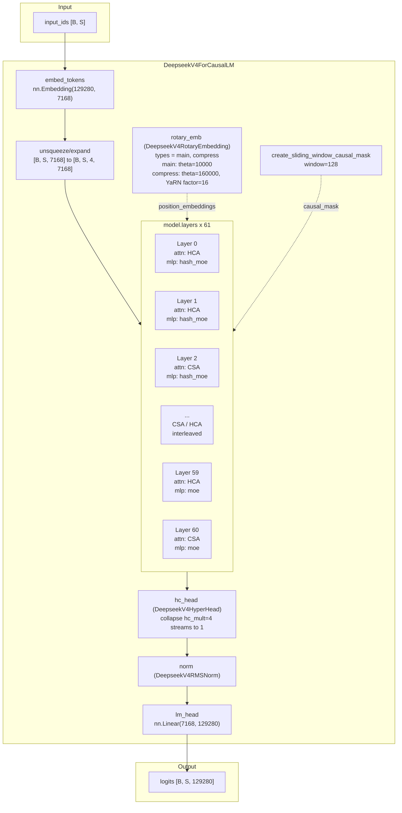

# DeepSeek-V4-Pro 架构结构图（ASC）

> 基于 [`DeepSeek-V4-Pro-config.json`](./config/DeepSeek-V4-Pro-config.json) 配置 + 本地 `transformers==5.9.0` 中 `transformers/models/deepseek_v4/` 源码核对。
> 注意：checkpoint 配置文件里记录的 `transformers_version` 是 `4.57.1`，但本地实际核对的推理实现版本是 `5.9.0`；下文会区分“配置中携带的旧字段”和“`__post_init__` 折叠后的运行时字段”。
> 源码路径：`transformers/models/deepseek_v4/{configuration_deepseek_v4.py, modeling_deepseek_v4.py, modular_deepseek_v4.py}`

---

## 1. 顶层结构（Top-level）

`DeepseekV4ForCausalLM` 继承 `DeepseekV4PreTrainedModel + GenerationMixin`，由 6 个核心部件组成：

| 组件 | 类型 | 说明 |
| --- | --- | --- |
| `model.embed_tokens` | `nn.Embedding` | vocab=129280 -> hidden=7168 |
| `model.layers` | `nn.ModuleList[DeepseekV4DecoderLayer]` | 共 **61** 层 |
| `model.norm` | `DeepseekV4RMSNorm` | 最终 RMSNorm |
| `model.rotary_emb` | `DeepseekV4RotaryEmbedding` | 运行时构建 `main` / `compress` 两套 RoPE |
| `model.hc_head` | `DeepseekV4HyperHead` | 把 `hc_mult=4` 条流折叠回 1 条 |
| `lm_head` | `nn.Linear` | hidden=7168 -> vocab=129280，`tie_word_embeddings=false` |

输入 `input_ids[B, S]` 会先变成 `[B, S, 7168]`，再在模型内部扩展为 `[B, S, hc_mult=4, 7168]`。之后经过 61 个 decoder 层、`hc_head`、`norm`、`lm_head`，输出 `logits[B, S, V]`。

### 1.1 关键超参（取自 config）

| 字段 | 值 | 含义 |
| --- | --- | --- |
| `hidden_size` | 7168 | 单条流隐层维度 D |
| `num_hidden_layers` | 61 | 解码层数 L |
| `num_attention_heads` | 128 | 注意力头数 n_h |
| `head_dim` | 512 | 单头维度 c |
| `num_key_value_heads` | 1 | Shared-KV MQA |
| `q_lora_rank` | 1536 | Q 的低秩瓶颈秩 r_q |
| `o_groups` | 16 | 分组输出投影组数 g |
| `o_lora_rank` | 1024 | 每组输出投影中间维度 |
| `qk_rope_head_dim` | 64 | 配置文件旧字段；运行时换算为 `partial_rotary_factor = 64 / 512 = 0.125` |
| `n_routed_experts` | 384 | 路由专家数 |
| `n_shared_experts` | 1 | 共享专家数 |
| `num_experts_per_tok` | 6 | top-k 路由数 |
| `moe_intermediate_size` | 3072 | 单专家 FFN 中间维度 |
| `expert_dtype` | `"fp4"` | 专家权重量化精度 |
| `scoring_func` | `"sqrtsoftplus"` | 路由打分函数 |
| `topk_method` | `"noaux_tc"` | 路由方法 |
| `routed_scaling_factor` | 2.5 | 路由权重放大系数 |
| `norm_topk_prob` | true | 路由概率归一化 |
| `hc_mult` | 4 | mHC 残差流数 H |
| `hc_sinkhorn_iters` | 20 | Sinkhorn-Knopp 迭代次数 |
| `hc_eps` | 1e-6 | Sinkhorn 数值稳定项 |
| `index_n_heads` | 64 | Lightning Indexer 头数 |
| `index_head_dim` | 128 | Indexer 单头维度 |
| `index_topk` | 1024 | Indexer 保留 top-k 压缩条目数 |
| `sliding_window` | 128 | 滑动窗口大小 |
| `swiglu_limit` | 10.0 | 专家 gate/up 预激活截断 |
| `max_position_embeddings` | 1,048,576 | 最大序列长度 |
| `rope_scaling` | yarn, factor=16, orig=65536 | 长上下文外推 |
| `compress_rope_theta` | 160000 | 压缩分支 RoPE 基频 |
| `compress_rates` | `{"compressed_sparse_attention": 4, "heavily_compressed_attention": 128}` | 运行时压缩率字典 |
| `compress_ratios` | 长度 62，前 61 项被采纳 | 配置文件旧字段；`__post_init__` 将其映射到运行时 `layer_types` |
| `num_hash_layers` | 3 | 配置文件旧字段；运行时折叠为 `mlp_layer_types` |
| `mlp_layer_types` | `["hash_moe"]*3 + ["moe"]*58` | 运行时每层 MLP 类型 |
| `layer_types` | `["heavily_compressed_attention"]*2 + ...` | 运行时每层注意力类型，由 `compress_ratios` 折叠得到 |
| `num_nextn_predict_layers` | 1 | MTP 层，不实例化 |
| `quantization_config` | FP8 e4m3, dynamic, weight_block_size=128 | 主权重量化 |
| `torch_dtype` | bfloat16 | 激活/权重主精度 |
| `tie_word_embeddings` | false | 输入/输出嵌入不共享 |

### 1.2 注意力层 schedule（`layer_types`）

这个 checkpoint 没有显式给 `layer_types`，而是通过旧字段 `compress_ratios` 在 `DeepseekV4Config.__post_init__` 中折叠得到 61 层运行时 `layer_types`。

需要特别注意两点：

- 原始 `compress_ratios` 长度是 62，但 `num_hidden_layers=61`，所以最后一个尾部 `0` 不参与前向。
- 实际参与前向的 61 层里 **没有** `sliding_attention` 层。

实际分布如下：

| 类型 | 压缩率 | 含义 | 层数 | 层索引 |
| --- | --- | --- | --- | --- |
| `sliding_attention` | 0 | 纯滑动窗口，无压缩 | **0** | 无 |
| `compressed_sparse_attention` | 4 | CSA + Lightning Indexer | **30** | 2, 4, 6, ..., 60 |
| `heavily_compressed_attention` | 128 | HCA 长程压缩 | **31** | 0, 1, 3, 5, ..., 59 |

即：这个 checkpoint 的实际 schedule 是 **前两层 HCA bootstrap，之后 CSA / HCA 严格交错，并以第 60 层 CSA 收尾**。

### 1.3 MLP 层 schedule

这个 checkpoint 通过旧字段 `num_hash_layers=3` 在 `__post_init__` 中折叠得到运行时 `mlp_layer_types`：

| 类型 | 层数 | 层索引 |
| --- | --- | --- |
| `hash_moe` | 3 | 0, 1, 2 |
| `moe` | 58 | 3 ... 60 |

---

## 2. 架构总览图

### 2.1 Mermaid 图



### 2.2 ASCII 字符图

```text
                            DeepseekV4ForCausalLM
   ┌──────────────────────────────────────────────────────────────────────────┐
   │                                                                          │
input_ids           rotary_emb (main/compress)        sliding_window mask
[B, S]              cos/sin for {main,compress}       window = 128
   │                          │                              │                │
   ▼                          │                              │                │
embed_tokens                  │                              │                │
nn.Embedding                  │                              │                │
(129280 -> 7168)              │                              │                │
   │                          │                              │                │
   ▼                          │                              │                │
unsqueeze/expand              │                              │                │
[B,S,7168]                    │                              │                │
   │                          │                              │                │
   ▼                          │                              │                │
[B,S,4,7168]                  │                              │                │
   │                          │                              │                │
   ├──────────────────────────┼──────────────────────────────┘                │
   │                          │                                               │
   ▼                          ▼                                               │
┌──────────────────────────────────────────────────────┐                      │
│  model.layers x 61  (see §3)                         │                      │
│                                                      │                      │
│  L0  HCA     + hash_moe   ─┐                         │                      │
│  L1  HCA     + hash_moe    │  31 HCA / 30 CSA        │                      │
│  L2  CSA     + hash_moe    │  3 hash_moe / 58 moe    │                      │
│  L3  HCA     + moe         │  (CSA/HCA strict        │                      │
│  L4  CSA     + moe         │   interleaved after L1) │                      │
│  ...                       │                         │                      │
│  L59 HCA     + moe         │                         │                      │
│  L60 CSA     + moe        ─┘                         │                      │
│                                                      │                      │
└──────────────────────────┬───────────────────────────┘                      │
                           │                                                  │
                           ▼                                                  │
                  ┌────────────────┐                                          │
                  │   hc_head      │  DeepseekV4HyperHead                     │
                  │   4 streams    │  collapse hc_mult=4 -> 1                 │
                  │   -> 1 stream  │                                          │
                  └───────┬────────┘                                          │
                          ▼                                                   │
                  ┌────────────────┐                                          │
                  │   RMSNorm      │  DeepseekV4RMSNorm                       │
                  └───────┬────────┘                                          │
                          ▼                                                   │
                  ┌────────────────┐                                          │
                  │   lm_head      │  nn.Linear(7168, 129280)                 │
                  │   7168 -> V    │  (tie_word_embeddings = false)           │
                  └───────┬────────┘                                          │
                          ▼                                                   │
                  logits [B, S, 129280]                                       │
                                                                              │
   └──────────────────────────────────────────────────────────────────────────┘
```

---

## 3. 单个 `DeepseekV4DecoderLayer` 内部残差

和 Flash 一样，Pro 的 `DecoderLayer` 也有两点关键差异：

- 残差不是单条流 `[B, S, D]`，而是 `hc_mult=4` 条并行流 `[B, S, H, D]`。
- 每个子层前后各嵌一个 `DeepseekV4HyperConnection`，用 Sinkhorn-Knopp 把 `comb` 映射到双随机矩阵流形。

其核心逻辑不依赖模型规模，源码实现完全复用 `DeepseekV4HyperConnection`：

```text
hidden_streams [B, S, H=4, D=7168]
  -> attn_hc -> collapsed [B, S, 7168]
  -> input_layernorm
  -> self_attn
  -> post * attn_out + comb^T @ hidden_in
  -> ffn_hc -> collapsed [B, S, 7168]
  -> post_attention_layernorm
  -> mlp
  -> post * mlp_out + comb^T @ hidden_in
  -> hidden_streams [B, S, 4, 7168]
```

`DeepseekV4HyperConnection.forward` 的关键公式：

```text
flat = RMSNorm(hidden_streams.flatten(2))                    # [B, S, H*D]
pre_w, post_w, comb_w = split(Linear(flat, fn), [H, H, H*H])
pre  = sigmoid(pre_w  * scale[0] + base[:H]) + eps
post = 2 * sigmoid(post_w * scale[1] + base[H:2H])
comb = softmax(comb_w.view(..., H, H) * scale[2] + base[2H:].view(H, H), dim=-1) + eps
comb = row/col normalization by Sinkhorn-Knopp for hc_sinkhorn_iters=20
collapsed = sum_h pre[h] * hidden_streams[..., h, :]
```

---

## 4. `DeepseekV4Attention` 内部

Pro 与 Flash 共用同一份 `DeepseekV4Attention` 实现，区别只在维度规模与层调度：

- Shared-KV MQA：`num_key_value_heads = 1`
- Partial RoPE：每头只对最后 `qk_rope_head_dim=64` 维做 RoPE
- 可学习 attention sink：每个 head 一个标量
- 分组低秩输出投影：避免 `128 * 512 = 65536` 直接投回 7168 的高代价
- HCA / CSA 层带压缩器，CSA 额外带 Lightning Indexer

### 4.1 Q / KV / Output 路径维度

| 路径 | 结构 | 输出形状 |
| --- | --- | --- |
| Q path | `q_a_proj: 7168 -> 1536` -> `q_a_norm` -> `q_b_proj: 1536 -> 128*512=65536` -> `q_b_norm` -> RoPE | `Q [B, 128, S, 512]` |
| KV path | `kv_proj: 7168 -> 512` -> `kv_norm` -> RoPE | `KV [B, 1, S, 512]` |
| Output path | grouped reshape -> `o_a_proj` 每组 `4096 -> 1024`，16 组 -> flatten 16384 -> `o_b_proj: 16384 -> 7168` | `attn_output [B, S, 7168]` |

其中：

- `num_attention_heads * head_dim = 128 * 512 = 65536`
- `o_groups = 16`，所以每组输入宽度仍然是 `65536 / 16 = 4096`
- `o_groups * o_lora_rank = 16 * 1024 = 16384`

### 4.2 Pro checkpoint 的注意力类型分布

| `layer_type` | 压缩器类 | 压缩率 | 实际层数 |
| --- | --- | --- | --- |
| `compressed_sparse_attention` | `DeepseekV4CSACompressor` | 4 | 30 |
| `heavily_compressed_attention` | `DeepseekV4HCACompressor` | 128 | 31 |

这个 checkpoint 没有 `sliding_attention` 层，但模型顶层仍会统一构建：

- `main` RoPE buffer
- `compress` RoPE buffer
- `create_sliding_window_causal_mask(...)`

其中真正被 61 个 attention block 消费的是 `compress` RoPE；`main` 这套 buffer 会被构建，但本 checkpoint 实际前向不会用到。

### 4.3 压缩器与 Indexer

| 组件 | 关键维度 | 说明 |
| --- | --- | --- |
| `DeepseekV4CSACompressor` | `kv_proj/gate_proj: 7168 -> 1024` | 2 个系列 Ca/Cb，overlap 窗口压缩 |
| `DeepseekV4Indexer` | `kv_proj/gate_proj: 7168 -> 256`，`q_b_proj: 1536 -> 8192`，`weights_proj: 7168 -> 64` | 64 个 index heads，`index_topk=1024` |
| `DeepseekV4HCACompressor` | `kv_proj/gate_proj: 7168 -> 512` | 单系列长程压缩，无 indexer |

---

## 5. `DeepseekV4SparseMoeBlock` 内部

同样，Pro 复用 Flash 的 MoE 代码路径，但规模更大。

### 5.1 Router 选型

| 层范围 | Router 类 | 选专家方式 | 备注 |
| --- | --- | --- | --- |
| `layer_idx in [0, 1, 2]` | `DeepseekV4HashRouter` | `tid2eid[input_ids]` frozen lookup | bootstrap 用 Hash-MoE |
| `layer_idx in [3, 60]` | `DeepseekV4TopKRouter` | `topk(sqrtsoftplus(logits) + bias, k=6)` | `noaux_tc` 偏置项在 `e_score_correction_bias` |

### 5.2 专家维度

| 组件 | 形状 / 结构 |
| --- | --- |
| routed experts | `gate_up_proj: [384, 6144, 7168]`, `down_proj: [384, 7168, 3072]` |
| shared expert | `gate_proj/up_proj: 7168 -> 3072`, `down_proj: 3072 -> 7168` |
| gate clamp | `gate <= 10`, `up in [-10, 10]` |
| routed scaling | `routed_scaling_factor = 2.5` |

运行逻辑：

```text
routed = experts(flat_hidden, top_k_index, top_k_weights)
shared = shared_experts(hidden_states)
return routed + shared
```

---

## 6. 缓存 / KV Cache 设计

虽然 Pro checkpoint 没有 `sliding_attention` 层，但缓存体系仍然和源码一致：

| 注意力层类型 | Cache 类 | 额外 state |
| --- | --- | --- |
| `compressed_sparse_attention` | `DeepseekV4CSACache` | `compressor` + `indexer` 两套 `(buffer_kv, buffer_gate, compressed_kv, entry_count)`，以及 `overlap_kv/gate` |
| `heavily_compressed_attention` | `DeepseekV4HCACache` | `compressor` 一套 `(buffer_kv, buffer_gate, compressed_kv, entry_count)` |

两类缓存都继承自 shared-KV 的 sliding-window 更新逻辑：

- 先维护最近 `sliding_window=128` 个原始 KV
- 再按层类型追加 CSA / HCA 产生的 `compressed_kv`

`Decode` 阶段的内存公式单独放在后面的 **§12 Decode 阶段内存需求公式**，这里仅保留 cache 结构说明。

---

## 7. RoPE 与位置编码

`DeepseekV4RotaryEmbedding` 运行时按 `rope_type_labels = ("main", "compress")` 建两套 buffer。它们不是直接从 JSON 的 `rope_parameters` 读出的，而是 `DeepseekV4Config.__post_init__` 用下列字段组合出来的：

- `rope_theta = 10000`
- `compress_rope_theta = 160000`
- `rope_scaling = yarn(factor=16, original_max_position_embeddings=65536)`
- `partial_rotary_factor = qk_rope_head_dim / head_dim = 64 / 512 = 0.125`

运行时语义：

- `main`: plain RoPE，给 `sliding_attention` 层准备
- `compress`: YaRN RoPE，给 `compressed_sparse_attention` / `heavily_compressed_attention` 及其内部 indexer 准备

对 Pro 这个 checkpoint 来说：

- 顶层前向仍会同时计算 `position_embeddings["main"]` 与 `position_embeddings["compress"]`
- 但所有 61 个 attention 层都是 CSA/HCA，因此实际只消费 `compress`

每头布局仍是：

```text
[nope(448) | rope(64)]
```

`apply_rotary_pos_emb` 仅对最后 64 维做交错 RoPE，`cos/sin` 先通过 `repeat_interleave(2)` 扩成完整 rope dim，再与 `rotate_half` 配对。

---

## 8. `DeepseekV4ForCausalLM.forward` 数据流

### 8.1 顶层前向

```text
input_ids [B, S]
  -> embed_tokens                               [B, S, 7168]
  -> unsqueeze(2).expand(hc_mult=4)            [B, S, 4, 7168]
  -> rotary_emb("main"), rotary_emb("compress")
  -> create_sliding_window_causal_mask(...)
  -> layers x 61
  -> hc_head                                   [B, S, 7168]
  -> norm
  -> lm_head                                   [B, S, 129280]
```

### 8.2 Router logits / aux loss

`DeepseekV4Model.forward` 通过 `@capture_outputs` 从 router 侧录出 `router_logits`，`DeepseekV4ForCausalLM.forward` 再按下面逻辑处理：

```text
aux_loss = load_balancing_loss(router_logits)
total_loss += router_aux_loss_coef * aux_loss
```

注意：

- 只有 `output_router_logits=True` 时才计算 `aux_loss`
- 只有同时传了 `labels` 时才把它乘上 `router_aux_loss_coef` 加回主 loss

---

## 9. 量化 / 部署相关

- `quantization_config.quant_method = "fp8"`
- `fmt = "e4m3"`, `activation_scheme = "dynamic"`, `scale_fmt = "ue8m0"`, `weight_block_size = [128, 128]`
- 专家权重额外 `expert_dtype = "fp4"`
- `base_model_ep_plan` 仍然是 EP-only，没有 `base_model_tp_plan`
- `_supports_flash_attn = _supports_sdpa = _supports_flex_attn = False`
  - FlashAttention 2/3/4：`head_dim=512` 超过 256 上限
  - SDPA：不支持 per-head sink
  - FlexAttention：动态追加压缩 KV 后，BlockMask 无法运行时扩展
- `_is_stateful = True`，因为 compressor cache 状态不可回滚
- `_keys_to_ignore_on_load_unexpected = [r"(^|\\.)mtp\\..*"]`，说明 checkpoint 里的 MTP 权重允许被忽略

---

## 10. 总览：一图看懂 V4-Pro

```text
   ┌────────────────────────────────────────────────────────────────────────┐
   │                                                                        │
   │   L0   HCA (m=128) + hash_moe     bootstrap                           │
   │   L1   HCA (m=128) + hash_moe                                          │
   │   L2   CSA (m=4)   + hash_moe                                          │
   │   L3   HCA         + moe                                               │
   │   L4   CSA         + moe                                               │
   │   L5   HCA         + moe                                               │
   │   ...  CSA / HCA 严格交错                                              │
   │   L59  HCA         + moe                                               │
   │   L60  CSA         + moe                                               │
   │                                                                        │
   │   total: 61 layers                                                     │
   │   attn schedule: 31 HCA + 30 CSA + 0 sliding                           │
   │   mlp  schedule: 3 hash_moe + 58 moe                                   │
   │   hidden streams throughout decoder: [B, S, 4, 7168]                   │
   │                                                                        │
   └────────────────────────────────────────────────────────────────────────┘
```

几个最关键的规模特征：

- `hidden_size = 7168`，高于 Flash 的 4096
- `num_attention_heads = 128`，但 `head_dim` 仍然是 512
- `q_lora_rank = 1536`
- `o_groups = 16`
- `n_routed_experts = 384`
- `index_topk = 1024`

---

## 11. Prefill 阶段算力估算（以 128K token 输入为例）

> 取 `S = 128 * 1024 = 131072`。
> 约定 1 次 multiply-add = 2 FLOPs，忽略 norm / RoPE / topk / Sinkhorn 等小项。

### 11.1 单层 FLOPs 模板

#### (1) Attn-Q 路径

```text
FLOPs_Q = 2 * S * [ hidden_size * q_lora_rank
                    + q_lora_rank * num_attention_heads * head_dim ]
```

#### (2) Attn-KV 投影

```text
FLOPs_KV_proj = 2 * S * hidden_size * head_dim
```

#### (3) 核心 attention

对 Pro 这个 checkpoint：

- `CSA`: `L_kv = sliding_window + index_topk = 128 + 1024 = 1152`
- `HCA`: `L_kv = sliding_window + ceil(S / (2 * compress_rate_hca)) = 128 + 512 = 640`

```text
FLOPs_core = 4 * S * L_kv * num_attention_heads * head_dim
```

#### (4) Compressor

```text
FLOPs_compressor = 8 * S * D * c      # CSA
FLOPs_compressor = 4 * S * D * c      # HCA
```

#### (5) Indexer（仅 CSA）

```text
FLOPs_indexer_lin =
    S * ( 8 * D * c_I + 2 * r_q * n_h_I * c_I + 2 * D * n_h_I )

FLOPs_indexer_attn =
    S^2 * n_h_I * c_I / compress_rate_csa
```

#### (6) Attn-Output 路径

```text
FLOPs_O = 2 * S * [ num_attention_heads * head_dim * o_lora_rank
                    + o_groups * o_lora_rank * hidden_size ]
```

#### (7) MoE

```text
FLOPs_moe = 6 * S * hidden_size * moe_intermediate_size * (num_experts_per_tok + 1)
```

### 11.2 代入 Pro config 数值

| 符号 | 字段 | 值 |
| --- | --- | --- |
| `S` | 输入长度 | 131072 |
| `D` | `hidden_size` | 7168 |
| `n_h` | `num_attention_heads` | 128 |
| `c` | `head_dim` | 512 |
| `r_q` | `q_lora_rank` | 1536 |
| `r_o_g` | `o_lora_rank` | 1024 |
| `o_groups` | `o_groups` | 16 |
| `compress_rate_csa` | `compress_rates.compressed_sparse_attention` | 4 |
| `compress_rate_hca` | `compress_rates.heavily_compressed_attention` | 128 |
| `n_h^I` | `index_n_heads` | 64 |
| `c^I` | `index_head_dim` | 128 |
| `index_topk` | `index_topk` | 1024 |
| `k` | `num_experts_per_tok` | 6 |
| `I` | `moe_intermediate_size` | 3072 |

| 项 | 公式 | 128K 数值 |
| --- | --- | --- |
| `FLOPs_Q` | `2*S*(D*r_q + r_q*n_h*c)` | **29.27 T** |
| `FLOPs_KV_proj` | `2*S*D*c` | **0.96 T** |
| `FLOPs_O` | `2*S*(n_h*c*r_o_g + o_groups*r_o_g*D)` | **48.38 T** |
| `FLOPs_compressor` (CSA / HCA) | `8*S*D*c / 4*S*D*c` | **3.85 T / 1.92 T** |
| `FLOPs_indexer_lin` (CSA) | `S*(8*D*c^I + 2*r_q*n_h^I*c^I + 2*D*n_h^I)` | **4.38 T** |
| `FLOPs_indexer_attn` (CSA) | `S^2*n_h^I*c^I/compress_rate_csa` | **35.18 T** |
| `FLOPs_core` (CSA) | `4*S*(128+1024)*n_h*c` | **39.58 T** |
| `FLOPs_core` (HCA) | `4*S*(128+512)*n_h*c` | **21.99 T** |
| `FLOPs_moe` | `6*S*D*I*(k+1)` | **121.22 T** |

### 11.3 单层算力

| 块 | CSA (x30) | HCA (x31) |
| --- | --- | --- |
| Q 路径 | 29.27 T | 29.27 T |
| KV 投影 | 0.96 T | 0.96 T |
| 核心 attn | 39.58 T | 21.99 T |
| Compressor | 3.85 T | 1.92 T |
| Indexer lin | 4.38 T | - |
| Indexer attn | 35.18 T | - |
| Output 路径 | 48.38 T | 48.38 T |
| MoE | 121.22 T | 121.22 T |
| **单层合计** | **282.83 T** | **223.75 T** |

### 11.4 全模型 61 层汇总（128K prefill）

| 块 | 数值 |
| --- | --- |
| 30 x CSA 全层 | **8 484.97 T** |
| 31 x HCA 全层 | **6 936.27 T** |
| 全部 61 层 attention + MoE | **≈ 15 421.23 T = 15.42 PFLOPs** |
| mHC 全层小量 | **≈ 22.01 T** |
| **Prefill 总算力** | **≈ 15.44 PFLOPs** |

### 11.5 算力大头

对 Pro 来说，128K prefill 的主要瓶颈依旧是三类：

1. `MoE routed + shared expert`
2. `o_a_proj + o_b_proj` 输出路径
3. `CSA indexer attention` 的 `O(S^2)` 项

相比 Flash，Pro 的总量级明显更高，原因很直接：

- 层数从 43 增到 61
- 隐层从 4096 增到 7168
- attention heads 从 64 增到 128
- routed experts 从 256 增到 384
- `index_topk` 从 512 增到 1024

---

## 12. Decode 阶段内存需求公式（128K 场景）

> 本章讨论的是 **decode 显存**，不是 prefill 算力。
> 口径分成三部分：**权重常驻**、**持久 cache**、**单步临时工作集**。

### 12.1 总公式

```text
M_decode_total
  ≈ M_weights
  + M_decode_cache
  + M_decode_tmp_peak
  + M_runtime_overhead
```

其中：

- `M_weights`：模型权重常驻显存
- `M_decode_cache`：跨 token 持续存在的 cache 状态
- `M_decode_tmp_peak`：单步 decode 的瞬时峰值工作集
- `M_runtime_overhead`：allocator / kernel workspace / 框架额外 buffer

### 12.2 权重显存

若按 checkpoint 标注的量化格式做**静态近似**：

- 非 expert 权重按 `FP8 e4m3` 估算：约 `1 Byte / param`
- routed expert 权重按 `FP4` 估算：约 `0.5 Byte / param`
- FP8 block scale 额外开销按 `weight_block_size = [128, 128]` 粗略记为 `1 / (128*128)` Byte / non-expert-param

则：

```text
M_weights
  ≈ N_nonexpert * 1
   + N_expert * 0.5
   + N_nonexpert / (128 * 128)
```

按本文前面给出的架构分解做粗估，Pro 的权重显存约为：

```text
M_weights(Pro)
  ≈ 799.31 GB
  ≈ 744.41 GiB
```

> 这是“单卡完整装下全部权重”的静态近似值；真实部署若使用 EP / TP / offload，单设备权重占用会下降。

### 12.3 持久 cache 显存

这里按 `transformers` 源码里的真实 cache 形态计算：

- `K` / `V` 在 cache 内部是**同一块张量**
- 持久滑动窗状态保存的是 `sliding_window - 1` 个 token
- 默认 `torch_dtype=bfloat16`，所以 `bytes_per_elem = 2`

记：

- `B` = batch size
- `e` = 每元素字节数（bf16 下 `e=2`）
- `S_ctx` = decode 开始前已在 cache 里的上下文长度；此处取 `128K = 131072`
- `c = head_dim = 512`
- `c^I = index_head_dim = 128`
- `m = compress_rate_csa = 4`
- `m' = compress_rate_hca = 128`
- `n_win = sliding_window = 128`

**HCA 层：**

```text
M_decode_cache(HCA)
  = B * e * [ (n_win - 1) * c
              + floor(S_ctx / m') * c
              + 2 * (S_ctx mod m') * c ]
```

**CSA 层：**

```text
M_decode_cache(CSA)
  = B * e * [ (n_win - 1) * c
              + floor(S_ctx / m) * (c + c^I)
              + 4 * (S_ctx mod m) * (c + c^I)
              + 2 * m * (c + c^I) ]
```

对 Pro，`128K = 131072` 同时被 `4` 和 `128` 整除，因此余量 buffer 项为 `0`：

| 层类型 | 公式 | 128K 数值 |
| --- | --- | --- |
| `HCA` | `B * 2 * (127*512 + 1024*512)` | `1,178,624 * B` Bytes = **1.124 MiB * B** |
| `CSA` | `B * 2 * (127*512 + 32768*512 + 32768*128 + 8*(512+128))` | `42,083,328 * B` Bytes = **40.134 MiB * B** |

全模型 61 层合计：

```text
M_decode_cache(total, Pro, 128K)
  = 31 * M_HCA + 30 * M_CSA
  = 1,299,037,184 * B Bytes
  = 1238.86 MiB * B
  ≈ 1.299 GB * B
```

> 单层 HCA / CSA 的 cache 数值和 Flash 一样，因为它们只依赖 `head_dim`、`index_head_dim`、压缩率和上下文长度，不依赖 `hidden_size`。

### 12.4 单步 decode 的临时工作集

eager attention 内部会临时创建：

```python
key_states = repeat_kv(key, num_attention_heads)
value_states = repeat_kv(value, num_attention_heads)
```

因此只估算这两块瞬时张量时：

```text
M_decode_tmp(attn)
  ≈ B * e * 2 * n_h * L_kv_decode * c
```

对 Pro 的 128K decode：

```text
L_kv_decode(CSA) = n_win + min(index_topk, floor(S_ctx / m))
                 = 128 + min(1024, 32768)
                 = 1152

L_kv_decode(HCA) = n_win + floor(S_ctx / m')
                 = 128 + 1024
                 = 1152
```

因此：

| 层类型 | `L_kv_decode` | 临时 `key_states + value_states` |
| --- | --- | --- |
| `CSA` | `1152` | **288.0 MiB * B** |
| `HCA` | `1152` | **288.0 MiB * B** |

### 12.5 合并口径

把权重和 cache 一起算进去，Pro 在 128K decode 下的**基础显存占用**可写成：

```text
M_decode_base(Pro, 128K)
  ≈ M_weights + M_decode_cache(total)
  ≈ 799.31 GB + 1.30 GB * B
```

若再叠加单步峰值，则：

```text
M_decode_peak
  ≈ M_weights + M_decode_cache(total) + max_layer M_decode_tmp(attn) + M_runtime_overhead
```

对 Pro 来说，`max_layer M_decode_tmp(attn)` 为 **288.0 MiB * B**。

## 13. 引用源

- 配置文件：`docs/deepseek_v4/config/DeepSeek-V4-Pro-config.json`
- `transformers==5.9.0`
  - `transformers/models/deepseek_v4/configuration_deepseek_v4.py`
  - `transformers/models/deepseek_v4/modeling_deepseek_v4.py`
  - `transformers/models/deepseek_v4/modular_deepseek_v4.py`
