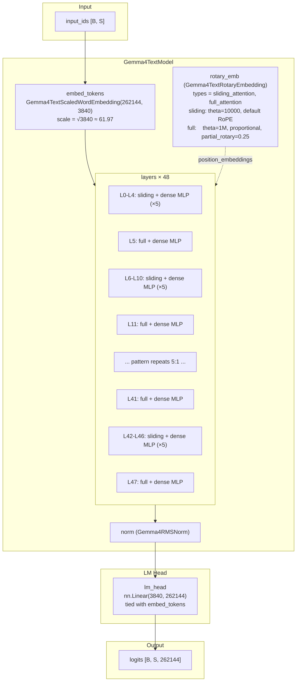
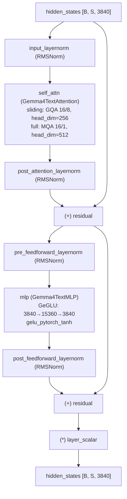
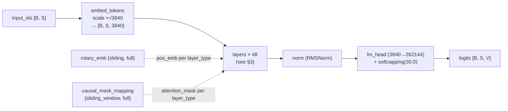

# Gemma-4-12B-it 架构结构图

> 基于 [`gemma-4-12B-it-config.json`](./config/gemma-4-12B-it-config.json) 配置 + 本地 `transformers==5.9.0` 中 `transformers/models/gemma4/` 源码核对。
> 注意：checkpoint 配置文件里记录的 `transformers_version` 是 `5.10.0.dev0`，但本地实际核对的推理实现版本是 `5.9.0`。
> 源码路径：`transformers/models/gemma4/{configuration_gemma4.py, modeling_gemma4.py, modular_gemma4.py}`

---

## 1. 顶层结构（Top-level）

`Gemma4ForConditionalGeneration` 是一个多模态模型（text + vision + audio），其中 **text backbone** `Gemma4TextModel` 是性能分析的核心。以下分析聚焦 text-only 推理路径。

`Gemma4TextModel` 继承 `Gemma4PreTrainedModel`，由 5 个核心部件组成：

| 组件 | 类型 | 说明 |
| --- | --- | --- |
| `embed_tokens` | `Gemma4TextScaledWordEmbedding` | vocab=262144 → hidden=3840，缩放因子 √3840 |
| `layers` | `nn.ModuleList[Gemma4TextDecoderLayer]` | 共 **48** 层 |
| `norm` | `Gemma4RMSNorm` | 最终 RMSNorm |
| `rotary_emb` | `Gemma4TextRotaryEmbedding` | 按 layer_type 分两组：`sliding_attention` / `full_attention` |
| `embed_tokens_per_layer` | `Gemma4TextScaledWordEmbedding` | PLE（Per-Layer Embeddings），**本 config 中禁用**（`hidden_size_per_layer_input=0`） |

`Gemma4ForCausalLM`（纯文本）或 `Gemma4ForConditionalGeneration`（多模态）在 text model 之上加 `lm_head`（`nn.Linear(3840, 262144)`，与 `embed_tokens` 权重共享）。

输入 `input_ids [B, S]` → embedding → 经 48 个 decoder 层 → `norm` → `lm_head` → `logits [B, S, V]`。

### 1.1 关键超参（取自 text_config）

| 字段 | 值 | 含义 |
| --- | --- | --- |
| `hidden_size` | 3840 | 隐层维度 D |
| `num_hidden_layers` | 48 | 解码层数 L |
| `num_attention_heads` | 16 | 注意头数 n_h |
| `head_dim` | 256 | sliding 层单头维度 c |
| `global_head_dim` | 512 | full_attention 层单头维度 c_global |
| `num_key_value_heads` | 8 | sliding 层 KV 头数（GQA 2:1） |
| `num_global_key_value_heads` | 1 | full_attention 层 KV 头数（**Shared-KV MQA**） |
| `attention_k_eq_v` | true | full_attention 层 K=V 共享投影 |
| `num_kv_shared_layers` | 0 | 无跨层 KV 共享 |
| `intermediate_size` | 15360 | FFN 中间维度（4× hidden_size） |
| `hidden_activation` | `gelu_pytorch_tanh` | FFN 激活函数 |
| `enable_moe_block` | false | 不使用 MoE，**纯 Dense** |
| `use_double_wide_mlp` | false | 不使用双倍宽 MLP |
| `sliding_window` | 1024 | 滑动窗口大小 n_win |
| `max_position_embeddings` | 262144 | 最大序列长度（256K） |
| `vocab_size` | 262144 | 词表大小 V |
| `tie_word_embeddings` | true | 输入/输出嵌入共享权重 |
| `final_logit_softcapping` | 30.0 | logits 软截断 |
| `use_bidirectional_attention` | `"vision"` | 仅视觉 token 使用双向注意力 |
| `hidden_size_per_layer_input` | 0 | **PLE 禁用** |
| `dtype` | bfloat16 | 主精度 |
| `attention_bias` | false | 注意力投影无 bias |

### 1.2 注意力层 schedule（`layer_types`）

48 层按 5:1 模式排列：每 5 层 `sliding_attention` 后接 1 层 `full_attention`，共 8 个 block，最后 1 层强制为 `full_attention`：

| 类型 | 含义 | 层数 | 层索引 |
| --- | --- | --- | --- |
| `sliding_attention` | 滑动窗口 + GQA(16/8) | **40** | 0-4, 6-10, 12-16, 18-22, 24-28, 30-34, 36-40, 42-46 |
| `full_attention` | 全局注意力 + MQA(16/1) | **8** | 5, 11, 17, 23, 29, 35, 41, 47 |

> sliding 层 head_dim=256, KV heads=8 (GQA 2:1)；full_attention 层 head_dim=512, KV heads=1 (MQA)，且 K=V 共享投影。

---

## 2. 架构总览图

### 2.1 Mermaid 图



### 2.2 ASCII 字符图

```
                        Gemma4TextModel (+ lm_head)
   ┌──────────────────────────────────────────────────────────────────────────┐
   │                                                                          │
input_ids               rotary_emb (sliding / full)
[B, S]                  cos/sin for {sliding, full}
   │                          │
   ▼                          │
embed_tokens                  │
Gemma4TextScaledWordEmbedding │
(262144 → 3840)               │
scale = √3840                 │
   │                          │
   ▼                          │
┌──────────────────────────────────────────────────────────────────┐         │
│  layers × 48                                                     │         │
│                                                                  │         │
│  L0  sliding + dense   ─┐                                        │         │
│  L1  sliding + dense    │                                        │         │
│  L2  sliding + dense    │                                        │         │
│  L3  sliding + dense    │  5 sliding                             │         │
│  L4  sliding + dense    │                                        │         │
│  L5  full + dense       │  1 full     ─┐                         │         │
│  L6  sliding + dense    │              │                         │         │
│  ...                    │  5 sliding   │                         │         │
│  L11 full + dense       │  1 full      │  × 8 blocks             │         │
│  ...                    │              │                         │         │
│  L41 full + dense       │  1 full      │                         │         │
│  L42 sliding + dense    │              │                         │         │
│  ...                    │  5 sliding   │                         │         │
│  L46 sliding + dense    │              │                         │         │
│  L47 full + dense      ─┘  1 full     ─┘                         │         │
│                                                                  │         │
│  40 sliding (GQA 16/8, head_dim=256, window=1024)                │         │
│   8 full    (MQA 16/1, head_dim=512, no window)                  │         │
└──────────────────────────┬───────────────────────────────────────┘         │
                           │                                                  │
                           ▼                                                  │
                    ┌──────────────┐                                          │
                    │   RMSNorm    │  Gemma4RMSNorm(3840)                     │
                    └──────┬───────┘                                          │
                           ▼                                                  │
                    ┌──────────────┐                                          │
                    │   lm_head    │  nn.Linear(3840, 262144)                 │
                    │   3840 → V   │  (tie_word_embeddings = true)            │
                    └──────┬───────┘                                          │
                           ▼                                                  │
                    logits [B, S, 262144]                                    │
   └──────────────────────────────────────────────────────────────────────────┘
```

---

## 3. 单个 `Gemma4TextDecoderLayer` 内部

标准的 Pre-Norm 残差块，结构简洁：

```
hidden_states [B, S, D=3840]
       │
       ▼
   input_layernorm (RMSNorm)
       │
       ▼
   self_attn (Gemma4TextAttention, see §4)
       │
       ▼
   post_attention_layernorm (RMSNorm)
       │
       ▼
   ┌──────────────┐
   │  (+) residual │
   └──────┬───────┘
          │
          ▼
   pre_feedforward_layernorm (RMSNorm)
          │
          ▼
   mlp (Gemma4TextMLP, see §5)
   GeGLU: gate_proj(3840→15360), up_proj(3840→15360), down_proj(15360→3840)
          │
          ▼
   post_feedforward_layernorm (RMSNorm)
          │
          ▼
   ┌──────────────┐
   │  (+) residual │
   └──────┬───────┘
          │
          ▼
   (*) layer_scalar (per-layer learnable scalar, init=1)
          │
          ▼
   hidden_states [B, S, D=3840]
```

> **PLE 在本模型中禁用**（`hidden_size_per_layer_input=0`），因此没有 per-layer input embedding 注入。
> **MoE 禁用**（`enable_moe_block=false`），因此没有 router / experts 分支。

### 3.1 Mermaid 图



---

## 4. `Gemma4TextAttention` 内部

根据 `layer_type` 分为两种模式，但结构大体一致：

### 4.1 Sliding Attention 层（40 层）

- **GQA 16/8**：16 个 Q 头，8 个 KV 头（每组 2 个 Q 头共享 1 对 KV 头）
- **head_dim = 256**
- **sliding_window = 1024**（local attention）
- K 和 V 独立投影

```
hidden_states [B, S, 3840]
       │
       ├─────────────────────────────────────────────┐
       │ Q path                                      │ KV path
       ▼                                             ▼
q_proj: 3840 → 16×256 = 4096                k_proj: 3840 → 8×256 = 2048
       │                                             │
       ▼                                             ▼
q_norm (RMSNorm 256)                         k_norm (RMSNorm 256)
       │                                             │
       ▼                                             ▼
apply_rotary_pos_emb                         apply_rotary_pos_emb
       │                                             │
       ▼                                             ▼
reshape [B, 16, S, 256]                      reshape [B, 8, S, 256]
       │                                             │
       │                                             ▼
       │                                      v_proj: 3840 → 8×256 = 2048
       │                                             │
       │                                             ▼
       │                                      v_norm (RMSNorm 256, no scale)
       │                                             │
       │                                             ▼
       │                                      reshape [B, 8, S, 256]
       │                                             │
       ▼                                             ▼
       │        repeat_kv (×2)  ────────────────────>│
       │        [B, 16, S, 256]                      │
       ▼                                             ▼
┌──────────────────────────────────────────────────────────┐
│  ALL_ATTENTION_FUNCTIONS (eager / sdpa / flash_attn)     │
│  attn = Q @ K^T / sqrt(head_dim)   (scaling = 1.0)      │
│  + causal sliding_window mask                            │
│  softmax → attn @ V                                      │
└──────────────────────────┬───────────────────────────────┘
                           │ attn_output [B, 16, S, 256]
                           ▼
                    reshape [B, S, 4096]
                           │
                           ▼
                    o_proj: 4096 → 3840
                           │
                           ▼
                    attn_output [B, S, 3840]
```

### 4.2 Full Attention 层（8 层）

- **MQA 16/1**：16 个 Q 头，1 个 KV 头（全头共享）
- **head_dim = 512**（global_head_dim）
- **无滑动窗口**（全局注意力）
- **K=V 共享投影**（`attention_k_eq_v=true`）

```
hidden_states [B, S, 3840]
       │
       ├─────────────────────────────────────────────┐
       │ Q path                                      │ KV path
       ▼                                             ▼
q_proj: 3840 → 16×512 = 8192                k_proj: 3840 → 1×512 = 512
       │                                             │
       ▼                                             ▼
q_norm (RMSNorm 512)                         k_norm (RMSNorm 512)
       │                                             │
       ▼                                             ▼
apply_rotary_pos_emb                         apply_rotary_pos_emb
       │                                             │
       ▼                                             ▼
reshape [B, 16, S, 512]                      v = k (K=V shared)
       │                                      reshape [B, 1, S, 512]
       │                                             │
       ▼                                             ▼
       │        repeat_kv (×16) ───────────────────>│
       │        [B, 16, S, 512]                      │
       ▼                                             ▼
┌──────────────────────────────────────────────────────────┐
│  ALL_ATTENTION_FUNCTIONS                                 │
│  attn = Q @ K^T / sqrt(512)  (scaling = 1.0)            │
│  + causal mask (no sliding window)                       │
│  softmax → attn @ V                                      │
└──────────────────────────┬───────────────────────────────┘
                           │ attn_output [B, 16, S, 512]
                           ▼
                    reshape [B, S, 8192]
                           │
                           ▼
                    o_proj: 8192 → 3840
                           │
                           ▼
                    attn_output [B, S, 3840]
```

### 4.3 关键对比

| 属性 | sliding_attention (×40) | full_attention (×8) |
| --- | --- | --- |
| Q 头数 | 16 | 16 |
| KV 头数 | 8 (GQA 2:1) | 1 (MQA) |
| head_dim | 256 | 512 |
| K=V 共享 | 否 | 是 |
| 滑动窗口 | 1024 | 无（全局） |
| Q 投影 | 3840→4096 | 3840→8192 |
| K 投影 | 3840→2048 | 3840→512 |
| V 投影 | 3840→2048 | 无（复用 K） |
| O 投影 | 4096→3840 | 8192→3840 |

---

## 5. `Gemma4TextMLP`（Dense GeGLU）

所有 48 层共用相同 MLP 结构（`use_double_wide_mlp=false`, `enable_moe_block=false`）：

```
hidden_states [B, S, 3840]
       │
       ├──────────────────────────┐
       ▼                          ▼
gate_proj: 3840 → 15360    up_proj: 3840 → 15360
       │                          │
       ▼                          │
gelu_pytorch_tanh                 │
       │                          │
       ▼                          ▼
       └───────►  (*)  ◄─────────┘
                   │
                   ▼
          down_proj: 15360 → 3840
                   │
                   ▼
          output [B, S, 3840]
```

公式：`y = down_proj(gelu_pytorch_tanh(gate_proj(x)) * up_proj(x))`

参数量：
- gate_proj: 3840 × 15360 = 58,982,400
- up_proj: 3840 × 15360 = 58,982,400
- down_proj: 15360 × 3840 = 58,982,400
- **MLP 合计 per layer**: 176,947,200

---

## 6. KV Cache 设计

使用标准 `DynamicCache`，按层类型区分行为：

| 注意力层类型 | Cache 行为 |
| --- | --- |
| `sliding_attention` | 仅保留最近 `sliding_window=1024` 个 token 的 KV |
| `full_attention` | 保留全部历史 token 的 KV |

- `num_kv_shared_layers=0`：无跨层 KV 共享，每层独立维护 KV cache
- K=V 共享的 full_attention 层：cache 中只存一份（既是 K 也是 V）

---

## 7. RoPE 与位置编码

`Gemma4TextRotaryEmbedding` 按 `layer_type` 维护两组独立 RoPE 参数：

| layer_type | rope_type | rope_theta | 其他 |
| --- | --- | --- | --- |
| `sliding_attention` | `default` | 10000 | 标准 RoPE |
| `full_attention` | `proportional` | 1,000,000 | `partial_rotary_factor=0.25` |

- `partial_rotary_factor=0.25` 意味着 full_attention 层仅对 head_dim 的最后 25% 维度施加 RoPE（512 × 0.25 = 128 维受 RoPE 影响，384 维不受影响）
- sliding 层 RoPE 作用于全部 256 维
- RoPE 在 Q 和 K 上独立施加（full_attention 层 K=V，但 RoPE 仅在 K 路径上施加一次）

---

## 8. `Gemma4TextModel.forward` 数据流

### 8.1 Mermaid 图



### 8.2 ASCII 字符图

```
   input_ids [B, S]              position_ids (auto-arange)
       │                                │
       ▼                                │
   embed_tokens                         │
   Gemma4TextScaledWordEmbedding        │
   (262144 → 3840) × √3840              │
       │                                │
       ▼                                │
       │       ┌──► rotary_emb {sliding, full} ──► pos_emb (cos, sin)
       │       │        ▲                             per layer_type
       │       │        │ position_ids
       │       │
       ▼       │
   ┌──────────────────────────────────────────────────────────┐
   │  layers × 48                                            │
   │  for i, layer in enumerate(layers):                      │
   │      layer_type = config.layer_types[i]                   │
   │      hidden_states = layer(                              │
   │          hidden_states,                                  │
   │          position_embeddings=pos_emb[layer_type],        │
   │          attention_mask=mask[layer_type],                │
   │          ...                                             │
   │      )                                                   │
   │      hidden_states *= layer_scalar                        │
   └──────────────────────────┬───────────────────────────────┘
                              │
                              ▼
                          RMSNorm
                              │
                              ▼
                          lm_head
                          3840 → 262144
                              │
                              ▼
                    final_logit_softcapping(30.0)
                              │
                              ▼
                         logits [B, S, V]
```

---

## 9. 量化 / 部署相关

- 本 checkpoint **无量化配置**（`quantization_config` 未出现），主精度 `bfloat16`
- TP plan 支持 (`base_model_tp_plan`)：Q/K/V/O 投影可切分，MLP gate/up 按列、down 按行
- EP plan 支持：router + experts（但本模型无 MoE，不涉及）
- PP plan 定义：embed → layers → norm 分段
- `_supports_flash_attn = _supports_sdpa = _supports_flex_attn = True`
- `_can_compile_fullgraph = True`：支持 `torch.compile`
- `tie_word_embeddings = True`：lm_head.weight 与 embed_tokens.weight 共享

---

## 10. 总览：一图看懂 Gemma-4-12B

### 10.1 Mermaid 图

```mermaid
flowchart LR
    classDef sliding fill:#e8f0ff,stroke:#3463a8
    classDef full fill:#fff4e6,stroke:#b87a2c

    L0["L0 sliding"]:::sliding
    L1["L1 sliding"]:::sliding
    L2["L2 sliding"]:::sliding
    L3["L3 sliding"]:::sliding
    L4["L4 sliding"]:::sliding
    L5["L5 full"]:::full
    L6["L6 sliding"]:::sliding
    Ld["... 5:1 pattern ..."]:::sliding
    L47["L47 full"]:::full

    L0 --> L1 --> L2 --> L3 --> L4 --> L5 --> L6 --> Ld --> L47
```



### 10.2 ASCII 字符图

```
   ┌────────────────────────────────────────────────────────────────────────┐
   │                                                                        │
   │   L0   ┌──────────┐   sliding_attention  +  dense GeGLU              │
   │   L1   ├──────────┤   sliding_attention  +  dense GeGLU              │
   │   L2   ├──────────┤   sliding_attention  +  dense GeGLU              │
   │   L3   ├──────────┤   sliding_attention  +  dense GeGLU              │
   │   L4   ├──────────┤   sliding_attention  +  dense GeGLU              │
   │   L5   ├──────────┤   full_attention     +  dense GeGLU   (MQA 16/1) │
   │   L6   ├──────────┤   sliding_attention  +  dense GeGLU              │
   │   ...  ├──────────┤   ... 5:1 pattern ...                              │
   │   L41  ├──────────┤   full_attention     +  dense GeGLU   (MQA 16/1) │
   │   L42  ├──────────┤   sliding_attention  +  dense GeGLU              │
   │   ...  ├──────────┤   ...                                            │
   │   L47  └──────────┘   full_attention     +  dense GeGLU   (MQA 16/1) │
   │                                                                        │
   │       ┌── 40 sliding  (GQA 16/8, head_dim=256, window=1024)           │
   │       └──  8 full     (MQA 16/1, head_dim=512, global)                │
   │                                                                        │
   │       total: 48 layers, Dense FFN throughout                           │
   │       PLE disabled (hidden_size_per_layer_input=0)                      │
   │       MoE disabled (enable_moe_block=false)                             │
   │                                                                        │
   └────────────────────────────────────────────────────────────────────────┘
```

- **每 6 层一个 pattern**：5 sliding（局部 GQA）+ 1 full（全局 MQA）
- **全部 dense FFN**，无 MoE
- **总参数 ≈ 11.91B**（详见 §11）

---

## 11. 关键超参速查表

| 维度 | 值 |
| --- | --- |
| 架构类型 | `Gemma4ForCausalLM`（decoder-only Dense） |
| 层数 L | 48 |
| 隐藏维度 D | 3840 |
| 注意力头 n_h | 16 |
| sliding 单头维度 c | 256 |
| full 单头维度 c_global | 512 |
| sliding KV 头 n_kv | 8（GQA 2:1） |
| full KV 头 n_kv_global | 1（MQA） |
| sliding window | 1024 |
| FFN 中间维度 I | 15360（4×） |
| FFN 激活 | gelu_pytorch_tanh (GeGLU) |
| 词表 V | 262144 |
| 最大上下文 | 262144（256K） |
| 主精度 | bfloat16 |
| 权重量化 | 无（bfloat16 原生） |
| 权重绑定 | tie_word_embeddings=true |
| Logit 软截断 | 30.0 |
| PLE | 禁用（hidden_size_per_layer_input=0） |
| MoE | 禁用（enable_moe_block=false） |
| KV 跨层共享 | 禁用（num_kv_shared_layers=0） |
| 注意力后端 | FA / SDPA / FlexAttention 均支持 |

### 11.1 参数概览

| 组件 | 参数量 |
| --- | --- |
| Embedding (262144 × 3840) | ~1.01B |
| 40 sliding layers: attn | 40 × 47.19M = ~1.89B |
| 40 sliding layers: MLP | 40 × 176.95M = ~7.08B |
| 8 full layers: attn | 8 × 64.88M = ~0.52B |
| 8 full layers: MLP | 8 × 176.95M = ~1.42B |
| RMSNorm 等小量 | <0.01B |
| **总计（含共享 lm_head）** | **≈ 11.91B** |

> bfloat16 权重显存：11.91B × 2 bytes ≈ **23.82 GB**（≈ **22.18 GiB**）

---

## 12. Prefill 阶段算力估算（以 128K token 输入为例）

> 取 `S = 128 × 1024 = 131072`（128K）作为示例。
> FLOPs 计数约定：1 次 multiply-add = 2 FLOPs；norm / RoPE / embedding / softcapping 等小项忽略。
> 本模型为 Dense 架构，所有层公式统一，仅 attention 部分按层类型区分。

### 12.1 符号表

| 符号 | 字段 | 值 |
| --- | --- | --- |
| `S` | 输入长度 | **131072**（= 128×1024） |
| `D` | `hidden_size` | 3840 |
| `n_h` | `num_attention_heads` | 16 |
| `c_s` | sliding `head_dim` | 256 |
| `c_f` | full `global_head_dim` | 512 |
| `n_kv_s` | sliding `num_key_value_heads` | 8 |
| `n_kv_f` | full `num_global_key_value_heads` | 1 |
| `n_win` | `sliding_window` | 1024 |
| `I` | `intermediate_size` | 15360 |
| `V` | `vocab_size` | 262144 |

### 12.2 单层 FLOPs 模板

每层拆成 **Attn-Q 路径**、**Attn-KV 路径**、**核心注意力**、**Attn-Output 路径**、**MLP** 5 个块。

#### (1) Attn-Q 路径（每层都跑）

```
Q_proj = D → n_h · c
FLOPs_Q = 2 · S · D · n_h · c
```

| 层类型 | c | n_h·c | FLOPs_Q |
| --- | --- | --- | --- |
| sliding | 256 | 4096 | 2·S·3840·4096 = 2·S·15.73M |
| full | 512 | 8192 | 2·S·3840·8192 = 2·S·31.46M |

#### (2) Attn-KV 路径（每层都跑）

```
K_proj = D → n_kv · c
V_proj = D → n_kv · c  (full 层 V=K，V 投影 = 0)
FLOPs_KV = 2 · S · D · n_kv · c · (1 + has_v_proj)
```

| 层类型 | has_v_proj | n_kv·c | FLOPs_KV |
| --- | --- | --- | --- |
| sliding | 1 | 2048 | 2·S·3840·2048·2 = 2·S·15.73M |
| full | 0 | 512 | 2·S·3840·512·1 = 2·S·1.97M |

#### (3) 核心注意力

```
L_kv(sliding) = n_win = 1024
L_kv(full)    = S = 131072

FLOPs_core = 4 · S · L_kv · n_h · c      (上界：完整 Q@K^T + attn@V 方阵)
```

| 层类型 | L_kv | FLOPs_core (上界) |
| --- | --- | --- |
| sliding | 1024 | 4·S·1024·16·256 = S·16.78M |
| full | S=131072 | 4·S·S·16·512 = S²·32768 |

> **Causal 修正**：以上是完整 S×S 方阵上界（eager 模式实际计算的 matmul）。**因果注意力**下有效 Q-K 对仅 S(S+1)/2 ≈ S²/2（query t 只能看到 ≤t 的 key）。
>
> - **Eager**：matmul 仍计算全部 S² 对（mask 在 softmax 前施加，但乘法已完成），故仍为 S²·32768。
> - **Flash Attention / SDPA**：tile 级别跳过上三角，有效计算 ≈ S²/2 对，故核心 FLOPs ≈ S²·16384。
>
> Gemma-4-12B 支持 FA/SDPA，实际部署以 ~S²·16384 为准。以下先按上界列出，再在汇总中给两种口径。

#### (4) Attn-Output 路径（每层都跑）

```
O_proj = n_h·c → D
FLOPs_O = 2 · S · n_h · c · D
```

| 层类型 | n_h·c | FLOPs_O |
| --- | --- | --- |
| sliding | 4096 | 2·S·4096·3840 = 2·S·15.73M |
| full | 8192 | 2·S·8192·3840 = 2·S·31.46M |

#### (5) MLP（每层都跑，Dense GeGLU）

```
gate_proj: D → I
up_proj:   D → I
down_proj: I → D

FLOPs_mlp = 2 · S · (2 · D · I + I · D) = 6 · S · D · I
          = 6 · S · 3840 · 15360
          = 6 · S · 58.98M
```

### 12.3 代入数值（S=131072）

| 公式 | FLOPs 数值 |
| --- | --- |
| `FLOPs_Q(sliding)` | 2·131072·15.73M = **4.124 T** |
| `FLOPs_Q(full)` | 2·131072·31.46M = **8.247 T** |
| `FLOPs_KV(sliding)` | 2·131072·15.73M = **4.124 T** |
| `FLOPs_KV(full)` | 2·131072·1.97M = **0.515 T** |
| `FLOPs_core(sliding)` | 131072·16.78M = **2.199 T** |
| `FLOPs_core(full)` eager (S²) | 131072²·32768 = **562.95 T** ⚠ |
| `FLOPs_core(full)` FA/SDPA (≈S²/2) | ≈ 131072²·16384 = **281.48 T** |
| `FLOPs_O(sliding)` | 2·131072·15.73M = **4.124 T** |
| `FLOPs_O(full)` | 2·131072·31.46M = **8.247 T** |
| `FLOPs_mlp` | 6·131072·58.98M = **46.371 T** |

### 12.4 单层算力汇总（128K prefill）

| 块 | sliding (×40) | full eager (×8) | full FA/SDPA (×8) |
| --- | --- | --- | --- |
| Q 路径 | 4.124 T | 8.247 T | 8.247 T |
| KV 路径 | 4.124 T | 0.515 T | 0.515 T |
| 核心 attn | 2.199 T | **562.95 T** ⚠ | **281.48 T** |
| Output 路径 | 4.124 T | 8.247 T | 8.247 T |
| MLP | 46.371 T | 46.371 T | 46.371 T |
| **单层合计** | **60.942 T** | **626.330 T** | **344.860 T** |

### 12.5 全模型 48 层汇总（128K prefill）

| 块 | eager (上界) | FA/SDPA (causal, ≈S²/2) |
| --- | --- | --- |
| 40 × sliding 全层 | 40 × 60.942 = **2,437.7 T** | 40 × 60.942 = **2,437.7 T** |
| 8 × full 全层 | 8 × 626.330 = **5,010.6 T** | 8 × 344.860 = **2,758.9 T** |
| **全部 48 层** | **≈ 7,448 T = 7.45 PFLOPs** | **≈ 5,197 T = 5.20 PFLOPs** |
| Embedding（`2·S·V`） | ≈ 0.069 T（忽略） | ≈ 0.069 T（忽略） |

### 12.6 算力占比（FA/SDPA 口径）

```
                       128K Prefill 算力构成 (FA/SDPA)
  ┌────────────────────────────────────────────────────────────┐
  │ MLP × 48                    ██████████████████████████████ │  42.8%
  │ full 8层 core_attn (O(S²))  █████████████████████████      │  43.4%
  │ sliding 40层 其他           ████                           │   6.7%
  │ full 8层 Q/KV/O             ███                            │   5.2%
  │ sliding 40层 core_attn      █                              │   1.7%
  └────────────────────────────────────────────────────────────┘
```

> **两个大头旗鼓相当**：
> 1. **full_attention 层的 O(S²) 核心注意力** — 43.4%（FA/SDPA 有效计算 ≈ S²/2）
> 2. **MLP × 48 层** — 42.8%（Dense 模型典型特征）
>
> 在 eager 模式下 full_attention 占 60.5%；FA/SDPA 下 causal 跳过上三角 tile，占比降至 43.4%，与 MLP 基本持平。

### 12.7 量级校验

- 11.91B Dense 模型，128K prefill，48 层 → **5.20 PFLOPs** (FA/SDPA) ~ **7.45 PFLOPs** (eager 上界)
- 作为对比：同参数级别的 Dense 模型 prefill 也在几个 PFLOPs 量级
- **关键瓶颈**：
  - eager: 8 个 full_attention 层的全局注意力 O(S²)，128K 单层 563 TFLOPs
  - FA/SDPA: causal 后有效约半，单层 ~281 TFLOPs
- S 增长到 256K 时，full_attention 的 core_attn 涨 4×（eager: 单层 2.25 PFLOPs，FA/SDPA: ~1.13 PFLOPs）

---

## 13. Decode 阶段内存需求公式（128K 场景）

> 口径分成三部分：**权重常驻**、**持久 cache**、**单步临时工作集**。

### 13.1 权重显存

bfloat16 精度，无量化：

```
M_weights = N_total · bytes_per_param
          = 11.91B × 2 bytes
          = 23.82 GB
          ≈ 22.18 GiB
```

### 13.2 持久 cache 显存

记：
- `B` = batch size
- `e` = 2（bfloat16）
- `S_ctx` = decode 开始时已在 cache 中的上下文长度；取 `128K = 131072`
- Cache 按 `DynamicCache` 存储，K/V 分别存储

**sliding 层（×40）：**

仅保留最近 `n_win = 1024` 个 token 的 KV：

```
M_cache_sliding_per_layer = B · e · (n_win) · n_kv_s · c_s · 2   (K + V)
                          = B · 2 · 1024 · 8 · 256 · 2
                          = B · 8,388,608 bytes
                          = 8.0 MiB · B
```

**full 层（×8）：**

保留全部 S_ctx 个 token 的 KV。虽然 `attention_k_eq_v=true` 使得 forward 中 `value_states = key_states`（同一 Python 引用，该步只产生一份张量数据），但 `DynamicLayer.update` 内部对 key 和 value 分别执行 `torch.cat`，两个 `torch.cat` 各自创建**独立存储的新张量**。实测 `data_ptr` 从 prefill 第一步起就不同。因此 cache 持久占用仍为 K+V 两份：

```
M_cache_full_per_layer = B · e · S_ctx · n_kv_f · c_f · 2   (K + V, torch.cat 各建独立存储)
                       = B · 2 · 131072 · 1 · 512 · 2
                       = B · 268,435,456 bytes
                       = 256.0 MiB · B
```

**全模型 48 层合计：**

```
M_cache_total = 40 · M_cache_sliding_per_layer + 8 · M_cache_full_per_layer
              = 40 · 8.0 MiB · B + 8 · 256.0 MiB · B
              = (320 + 2048) MiB · B
              = 2,368 MiB · B
              ≈ 2.31 GiB · B
```

### 13.3 单步 decode 的临时工作集

eager attention 内部 `repeat_kv` 会产生瞬时大张量：

```
M_tmp = B · e · 2 · n_h · L_kv_decode · c   (key_states + value_states, 各自 repeat 后)
```

decode 时的 L_kv_decode：

```
L_kv_decode(sliding) = n_win + 1 = 1025     (当前 token + cache)
L_kv_decode(full)    = S_ctx + 1 = 131073
```

| 层类型 | L_kv_decode | 临时 `key_states + value_states` |
| --- | --- | --- |
| sliding | 1025 | B·2·2·16·1025·256 = **16.0 MiB · B** |
| full | 131073 | B·2·2·16·131073·512 = **4096.0 MiB · B** = **4.0 GiB · B** |

> ⚠️ full_attention 层单步 decode 时 repeat_kv 产生的临时工作集达 4 GiB·B，是 decode 显存峰值的决定性因素。

### 13.4 合并口径

Flash attention 或 SDPA 后端可以大幅减少临时工作集（不显式 repeat_kv）。以下按 eager 上限估算：

```
M_decode_base(128K)
  ≈ M_weights + M_cache_total
  ≈ 23.82 GB + 2.31 GB · B

M_decode_peak(128K, eager)
  ≈ M_weights + M_cache_total + max_layer M_tmp
  ≈ 23.82 GB + 2.31 GB · B + 4.0 GB · B
  ≈ 23.82 GB + 6.31 GB · B
```

| B | M_decode_base | M_decode_peak (eager) |
| --- | --- | --- |
| 1 | ~26.1 GB | ~30.1 GB |
| 2 | ~28.4 GB | ~36.4 GB |
| 4 | ~33.1 GB | ~49.1 GB |
| 8 | ~42.3 GB | ~74.3 GB |

> 使用 Flash Attention / SDPA 时，临时工作集大幅减少，M_decode_peak ≈ M_decode_base + O(MiB)。

---

## 14. 引用源

- 配置文件：`docs/gemma_4/config/gemma-4-12B-it-config.json`
- `transformers==5.9.0`：
  - `transformers/models/gemma4/configuration_gemma4.py`
  - `transformers/models/gemma4/modeling_gemma4.py`
  - `transformers/models/gemma4/modular_gemma4.py`
