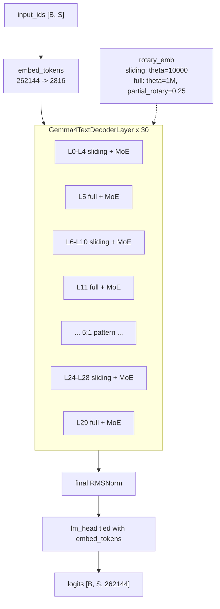

# gemma-4-26B-A4B-it 架构结构图

> 基于 [`gemma-4-26B-A4B-it-config.json`](./config/gemma-4-26B-A4B-it-config.json) 配置，并用本地 `transformers==5.9.0` 中 `transformers/models/gemma4/` 源码核对。
> checkpoint 配置文件记录的 `transformers_version` 是 `5.5.0.dev0`。
> 源码路径：`/home/perry/venv/python_3_12/lib/python3.12/site-packages/transformers/models/gemma4/{configuration_gemma4.py, modeling_gemma4.py, modular_gemma4.py}`。

---

## 1. 顶层结构

`Gemma4ForConditionalGeneration` 是多模态模型，包含 text 和 vision 配置。性能计算首版按 text-only 推理路径分析，核心是 `Gemma4TextModel`。

text backbone 由以下部分组成：

| 组件 | 类型 | 说明 |
| --- | --- | --- |
| `embed_tokens` | `Gemma4TextScaledWordEmbedding` | vocab=262144 -> hidden=2816，输入 embedding |
| `layers` | `nn.ModuleList[Gemma4TextDecoderLayer]` | 共 30 层 decoder |
| `norm` | `Gemma4RMSNorm` | 最终 RMSNorm |
| `rotary_emb` | `Gemma4TextRotaryEmbedding` | 按 `sliding_attention` 和 `full_attention` 两类 RoPE 参数生成 |
| `lm_head` | tied linear head | `tie_word_embeddings=true`，与输入 embedding 共享权重 |

输入 `input_ids [B, S]` 经 embedding、30 层 decoder、最终 RMSNorm 和 tied lm head 后输出 `logits [B, S, 262144]`。

### 1.1 关键超参

| 字段 | 值 | 含义 |
| --- | ---: | --- |
| `model_type` | `gemma4` | 顶层模型类型 |
| `text_config.model_type` | `gemma4_text` | text backbone 类型 |
| `dtype` | `bfloat16` | 权重/激活默认精度 |
| `hidden_size` | 2816 | 隐层维度 D |
| `num_hidden_layers` | 30 | decoder 层数 L |
| `num_attention_heads` | 16 | query heads |
| `head_dim` | 256 | sliding attention head dim |
| `global_head_dim` | 512 | full attention head dim |
| `num_key_value_heads` | 8 | sliding attention KV heads |
| `num_global_key_value_heads` | 2 | full attention KV heads |
| `attention_k_eq_v` | true | full attention 中 K/V 共享投影语义 |
| `sliding_window` | 1024 | sliding attention 可见窗口 |
| `max_position_embeddings` | 262144 | 最大上下文长度 |
| `vocab_size` | 262144 | 词表大小 |
| `enable_moe_block` | true | FFN 使用 MoE block |
| `num_experts` | 128 | routed experts 总数 |
| `top_k_experts` | 8 | 每 token 激活专家数 |
| `moe_intermediate_size` | 704 | 单个 routed expert 中间维度 |
| `intermediate_size` | 2112 | config 保留的 dense/shared FFN 宽度字段 |
| `hidden_activation` | `gelu_pytorch_tanh` | FFN/expert 激活 |
| `use_double_wide_mlp` | false | 不使用 double-wide MLP |
| `hidden_size_per_layer_input` | 0 | PLE 禁用 |

### 1.2 层类型 schedule

30 层按 5:1 模式排列：每 5 层 `sliding_attention` 后接 1 层 `full_attention`。

| 类型 | 层数 | 层索引 | 注意力形态 |
| --- | ---: | --- | --- |
| `sliding_attention` | 25 | 0-4, 6-10, 12-16, 18-22, 24-28 | GQA 16/8, head_dim=256, window=1024 |
| `full_attention` | 5 | 5, 11, 17, 23, 29 | global attention, 16 query heads / 2 KV heads, head_dim=512 |

---

## 2. 架构总览图

### 2.1 Mermaid 图



### 2.2 ASCII 图

```text
                  Gemma4 text-only path

input_ids [B, S]
      |
      v
embed_tokens: vocab 262144 -> D=2816
      |
      v
+------------------------------------------------------------+
| decoder layers x 30                                       |
|                                                            |
|   L0  sliding attention + MoE  --+                         |
|   L1  sliding attention + MoE    |                         |
|   L2  sliding attention + MoE    |  5 sliding              |
|   L3  sliding attention + MoE    |                         |
|   L4  sliding attention + MoE  --+                         |
|   L5  full attention    + MoE                              |
|                                                            |
|   pattern repeats until L29                               |
|                                                            |
|   25 sliding: Q heads=16, KV heads=8,  head_dim=256        |
|    5 full:    Q heads=16, KV heads=2,  head_dim=512        |
|                                                            |
|   each layer FFN site: Router -> top-8 / 128 routed experts|
+------------------------------------------------------------+
      |
      v
final RMSNorm -> tied lm_head -> logits [B, S, 262144]
```

---

## 3. 单层结构

`Gemma4TextDecoderLayer` 是 Pre-Norm 残差块。源码中 `enable_moe_block=true` 时，dense MLP site 替换为 router + routed experts。

```text
hidden_states [B, S, D=2816]
      |
      v
input_layernorm
      |
      v
self_attn
  sliding layer: Q 16x256, KV 8x256, window=1024
  full layer:    Q 16x512, KV 2x512, full context
      |
      v
post_attention_layernorm
      |
      + residual
      |
      v
pre_feedforward_layernorm
      |
      v
router: Linear(2816 -> 128), top_k=8, weights normalized
      |
      v
routed experts:
  gate_up_proj [128, 2 * 704, 2816]
  down_proj    [128, 2816, 704]
      |
      v
post_feedforward_layernorm
      |
      + residual
      |
      v
layer_scalar
      |
      v
hidden_states [B, S, D=2816]
```

### 3.1 MoE 路径

本地源码核对到的关键实现点：

- `Gemma4TextDecoderLayer` 在 `enable_moe_block=true` 时创建 router 和 experts。
- Router 是 `Linear(hidden_size, num_experts, bias=false)`，输出 128 个专家分数。
- Router 取 `top_k_experts=8`，top-k 权重归一化后乘以 per-expert scale。
- Experts 使用 fused 参数：
  - `gate_up_proj`: `[num_experts, 2 * moe_intermediate_size, hidden_size]`
  - `down_proj`: `[num_experts, hidden_size, moe_intermediate_size]`
- 每个专家等价 GeGLU/SwiGLU 类三投影规模：`3 * D * I_moe`。

---

## 4. Attention / Cache / RoPE

### 4.1 Sliding attention

| 项 | 值 |
| --- | ---: |
| 层数 | 25 |
| Query heads | 16 |
| KV heads | 8 |
| Head dim | 256 |
| KV 可见长度 | `min(S, 1024)` |
| RoPE theta | 10000 |
| RoPE type | `default` |

Decode 阶段每层持久 KV cache 约：

```text
B * bytes * sliding_window * num_kv_heads * head_dim * 2
```

### 4.2 Full attention

| 项 | 值 |
| --- | ---: |
| 层数 | 5 |
| Query heads | 16 |
| KV heads | 2 |
| Head dim | 512 |
| KV 可见长度 | decode context length |
| RoPE theta | 1000000 |
| RoPE type | `proportional` |
| Partial rotary factor | 0.25 |

Decode 阶段每层持久 KV cache 约：

```text
B * bytes * S_ctx * num_global_key_value_heads * global_head_dim * 2
```

---

## 5. 参数规模估算

配置文件没有显式 `num_parameters` 字段。工程接入时建议：

- `totalParamsB`: 按模型名 `26B` 作为常驻总参数量估算。
- `totalExpertParamsB`: 由 routed experts 结构推导。
- 非专家参数量：`26B - totalExpertParamsB`，作为 attention、embedding、router、norm 和其他共享权重的工程估算。

Routed experts 参数估算：

```text
per_expert_params = 3 * D * I_moe
                  = 3 * 2816 * 704
                  = 5,947,392

all_routed_experts = L * E * per_expert_params
                   = 30 * 128 * 5,947,392
                   = 22.84B params
```

按 `26B` 总量估算：

| 项 | 参数量 |
| --- | ---: |
| Total params | 26.00B |
| Routed expert params | 22.84B |
| Non-expert params | 3.16B |
| Active expert fraction | 8 / 128 = 6.25% |

> 注意：`intermediate_size=2112` 在配置中保留，但 routed expert 实际使用 `moe_intermediate_size=704`。工程接入时应优先用 `moe_intermediate_size` 表达 MoE 计算，不要把该模型当普通 dense FFN。

---

## 6. Prefill FLOPs 估算

以下按 text-only、batch=1、`S=128K=131072`、bf16 计算。FLOPs 口径与现有计算器保持一致，按矩阵乘加 `2 * M * N * K` 估算。

符号：

- `D=2816`
- `S=131072`
- `n_h=16`
- `c_s=256`
- `c_f=512`
- `n_kv_s=8`
- `n_kv_f=2`
- `I_moe=704`
- `k=8`
- `E=128`
- `n_win=1024`

### 6.1 Sliding layer

```text
F_Q       = 2 * S * D * n_h * c_s
F_KV      = 2 * S * D * n_kv_s * c_s * 2
F_core    = 2 * S * n_win * n_h * c_s
F_O       = 2 * S * n_h * c_s * D
F_MoE     = 6 * S * D * I_moe * (k + 1)
F_sliding = F_Q + F_KV + F_core + F_O + F_MoE
```

128K 场景：

| 项 | 每层 FLOPs |
| --- | ---: |
| Q path | 3.02T |
| KV projection | 3.02T |
| Core attention | 1.10T |
| Output projection | 3.02T |
| MoE | 14.03T |
| Sliding layer total | 24.20T |
| 25 sliding layers total | 605.05T |

### 6.2 Full layer

`attention_k_eq_v=true`，full attention 的 KV 投影按共享 K/V 的一组投影估算。

```text
F_Q    = 2 * S * D * n_h * c_f
F_KV   = 2 * S * D * n_kv_f * c_f
F_core = 2 * S^2 * n_h * c_f
F_O    = 2 * S * n_h * c_f * D
F_MoE  = 6 * S * D * I_moe * (k + 1)
F_full = F_Q + F_KV + F_core + F_O + F_MoE
```

128K 场景：

| 项 | 每层 FLOPs |
| --- | ---: |
| Q path | 6.04T |
| KV projection | 0.75T |
| Core attention | 281.47T |
| Output projection | 6.04T |
| MoE | 14.03T |
| Full layer total | 308.36T |
| 5 full layers total | 1541.79T |

### 6.3 Prefill 总量

```text
F_prefill = 25 * F_sliding + 5 * F_full
          ~= 2.15 PFLOPs at 128K
```

Full attention 层数只有 5 层，但 128K prefill 下 `S^2` attention core 是主要算力来源。

---

## 7. Decode 显存与流量估算

以下按 batch=1、`S_ctx=128K=131072`、bf16 `bytes=2` 估算。

### 7.1 权重常驻

```text
M_weights ~= totalParamsB * 2 bytes
          ~= 26.00B * 2
          ~= 52.00 GB
```

若工程平台输入使用不同 `bytesPerWeight` / `bytesPerExpert`，应按计算器平台参数动态计算。

### 7.2 Decode 每 token 权重读取

MoE decode 不需要每 token 读取所有专家权重；带宽流量按非专家全量 + active expert fraction 估算：

```text
B_weight_decode =
  non_expert_params * bytesPerWeight
  + routed_expert_params * (top_k / num_experts) * bytesPerExpert
```

bf16 全权重口径下：

```text
non_expert = 3.16B
routed_expert_active = 22.84B * 8 / 128 = 1.43B
B_weight_decode ~= (3.16B + 1.43B) * 2 = 9.18 GB/token
```

该值是性能估算中的 decode bandwidth 关键项。若专家权重量化为 `bytesPerExpert=0.5`，active expert 部分会相应下降。

### 7.3 Persistent KV cache

Sliding attention 每层：

```text
B * bytes * n_win * n_kv_s * c_s * 2
= 1 * 2 * 1024 * 8 * 256 * 2
= 8.39 MB/layer
```

Full attention 每层：

```text
B * bytes * S_ctx * n_kv_f * c_f * 2
= 1 * 2 * 131072 * 2 * 512 * 2
= 536.87 MB/layer
```

128K 总 persistent cache：

```text
25 * 8.39 MB + 5 * 536.87 MB = 2.89 GB
```

### 7.4 单步临时工作集

repeat/broadcast KV 后的 full attention 临时峰值按最大 visible length 估算：

```text
M_tmp ~= B * bytes * 2 * n_h * S_ctx * c_f
      ~= 1 * 2 * 2 * 16 * 131072 * 512
      ~= 4.30 GB
```

### 7.5 128K decode 峰值显存

```text
M_peak ~= M_weights + M_cache + M_tmp + M_overhead
M_overhead = max(4 GB, M_weights * 0.03)
```

bf16 估算：

| 项 | 显存 |
| --- | ---: |
| Weight memory | 52.00 GB |
| Persistent KV cache | 2.89 GB |
| Single-step temp peak | 4.30 GB |
| Runtime overhead | 4.00 GB |
| Decode peak | 63.19 GB |

---

## 8. 工程接入建议

该模型不是普通 dense decoder。工程适配时应避免复用 `dense-decoder-transformer` 的 dense FFN 口径。

建议字段：

```ts
{
  family: "gemma-4",
  id: "gemma-4-26b-a4b-it",
  displayName: "google/gemma-4-26B-A4B-it",
  architectureKind: "dense-decoder-moe",
  formulaStrategyId: "dense-decoder-moe",
  configSource: "docs/gemma_4/config/gemma-4-26B-A4B-it-config.json",
  contextLimit: 262144,
  decoderLayers: 30,
  hiddenSize: 2816,
  attentionHeads: 16,
  kvHeads: 8,
  headDim: 256,
  slidingWindow: 1024,
  slidingLayerCount: 25,
  fullAttentionLayerCount: 5,
  slidingAttentionLayerCount: 25,
  globalHeadDim: 512,
  numGlobalKeyValueHeads: 2,
  attentionKEqV: true,
  moeExperts: 128,
  activeExperts: 8,
  moeIntermediateSize: 704,
  intermediateSize: 2112,
  totalParamsB: 26.0,
  totalExpertParamsB: 22.84,
  estimatedWeightsGb: 52.0
}
```

公式策略应覆盖：

- sliding/full attention prefill FLOPs。
- MoE FFN FLOPs：`6 * S * D * I_moe * (top_k + 1)`，其中 `+1` 用作 shared/dense path 工程口径；如后续源码确认没有 shared path，应调整为 `top_k`。
- decode active expert 权重读取：`expert_params * top_k / num_experts`。
- sliding/full KV cache 的持久显存和 decode cache traffic。

---

## 9. 待确认项

- `totalParamsB=26.0` 来自模型名，配置文件没有显式参数量字段。
- `totalExpertParamsB=22.84` 由 routed expert 参数形状推导。
- `intermediate_size=2112` 与 `moe_intermediate_size=704` 的运行时关系需要在工程适配前最终确认；当前文档按源码中 routed experts 的 `moe_intermediate_size` 作为主要 MoE 计算宽度。
- 当前分析聚焦 text-only 路径；vision token 注入、多模态 prefill 和图像 soft tokens 不纳入首版性能估算。
